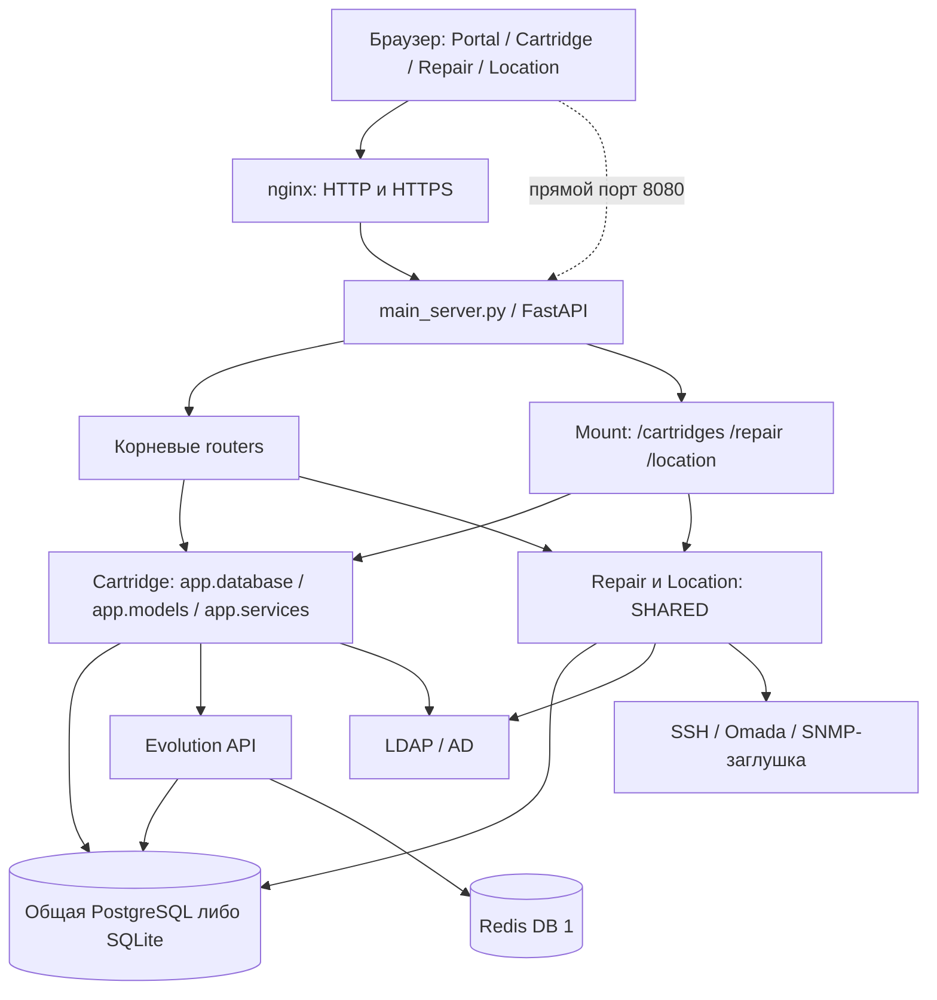

# Архитектура REP_ZAP_INV: аудит и целевое состояние

Дата: 28.09.2026. Репозиторий: ZQRey/REP_ZAP_INV (private). Проверяемый commit: `ecd7afa17ec1166b1427ca53b041a8e4e360137f`, ветка `main`.

## Область и достоверность

Получены все 92 файла дерева GitHub, без усечения дерева; 61 Python-файл разобран AST, составлен реестр 112 объявлений HTTP-операций. Просмотрены backend, схемы, сервисы, HTML/JS/CSS, шаблоны, Docker/nginx, тесты, конфигурация и имеющиеся планы. Реестр файлов приведён ниже. Ссылки на код закреплены на commit; номера строк относятся к нему.

Это статический аудит снимка, а не утверждение об отсутствии иных уязвимостей. Production, фактическая схема/данные БД, установленные версии зависимостей и история всех Git-коммитов не исследованы. Приложение, миграции, тесты с побочными эффектами, LDAP, Evolution и сетевые устройства не запускались. В доступном Python отсутствуют зависимости приложения. AST-проверка не заменяет интеграционные тесты. Код и поведение приложения не изменены; созданы только документы аудита.

## Текущая система



`main_server.py:13–32,155–210,219–249` меняет `sys.path`, импортирует модуль Cartridge двумя пространствами имён (`app.*` и `CARTRIDGE.app.*`), одновременно регистрирует routers в корне и монтирует три sub-app. Это модульный монолит с незавершённым объединением общего слоя, а не независимые сервисы. Вся бизнес-логика работает в одном сервере и разделяет БД.

| Подсистема | Реальная ответственность и состояние |
|---|---|
| Portal | Статическая оболочка, логин `/api/v1/auth/login`, профиль, настройки/пользователи, переходы в модули. Отдельного backend-сервиса Portal нет. Передаёт JWT через query string. |
| Cartridge | Учёт, приёмка/выдача, партии, история, отчёты XLSX/PDF, печать, AD-пользователи и единственная интеграция WhatsApp. Использует legacy `app.*`. |
| Repair | Общие активы, жизненный цикл ремонта, партии/стоимости, справочник моделей, AD computers, отчёты XLSX. Имеет также вторую реализацию управления коммутаторами. |
| Location | Этажи/зоны/координаты активов, портовые связи, трассировка и ручной опрос оборудования. Изменяет те же `assets`, что Repair. |
| SHARED | 22 ORM-таблицы, отдельные engine/Base/auth/config/LDAP. Общие сущности смешаны с доменными и инфраструктурными. |
| Network | SSH и Omada-клиенты, MAC matching и автоматическое изменение размещения. SNMP walk не реализован; UDP connect и `return []`. Демо может записываться как реальная телеметрия. |
| PostgreSQL | Основной compose задаёт PostGIS/PostgreSQL 15. ORM не использует геометрические типы PostGIS; координаты — Float/JSON. Evolution использует тот же DB user/database, отдельный schema в URI. |
| Redis | Контейнер опубликован наружу. Evolution использует DB 1. `REDIS_URL` передаётся серверу, но Python-клиента, очереди задач, worker и Pub/Sub в коде нет. Комментарий compose о workers/WebSocket не подтверждён реализацией. |
| Monitoring | `/health` отвечает константой, в том числе указывает SQLite при PostgreSQL. Есть nginx/PG healthchecks и logging/print. Нет readiness, метрик, трассировки, планировщика опроса, алертов. `AuditLog` определён, но не записывается. |

У main и Cartridge есть отдельные lifespan init. В штатном mount lifecycle дочернего приложения автоматически не запускается — нельзя рассчитывать на выполнение обеих инициализаций при старте единого сервера. При отдельном запуске Cartridge действует другой seed и набор DDL. Основание: [FastAPI lifespan/sub-applications](https://fastapi.tiangolo.com/advanced/events/#sub-applications).

## Дубли и расхождения

| Область | Реализации | Существенное расхождение / риск |
|---|---|---|
| SQLAlchemy Base | [SHARED/database.py:27](https://github.com/ZQRey/REP_ZAP_INV/blob/ecd7afa17ec1166b1427ca53b041a8e4e360137f/SHARED/database.py#L27), [CARTRIDGE/app/database.py:13](https://github.com/ZQRey/REP_ZAP_INV/blob/ecd7afa17ec1166b1427ca53b041a8e4e360137f/CARTRIDGE/app/database.py#L13) | Две независимые metadata для одних физических таблиц. |
| Engine / Session / get_db | Те же файлы | Два пула/набора dependencies; override одного не подменяет другой. Разная нормализация DSN. |
| ORM | `SHARED/models.py`, `CARTRIDGE/app/models.py` | Повторены Branch, AppUser, SystemSetting, ADUser, CartridgeModel, Cartridge, Batch, BatchItem, HistoryLog и enum CartridgeStatus. В SHARED есть `network_subnets` и дополнительные связи Branch; legacy Branch о них не знает. Default AppUser.role: `operator` против `user`. |
| Init / schema | [SHARED/database.py:43](https://github.com/ZQRey/REP_ZAP_INV/blob/ecd7afa17ec1166b1427ca53b041a8e4e360137f/SHARED/database.py#L43), [CARTRIDGE/app/database.py:24](https://github.com/ZQRey/REP_ZAP_INV/blob/ecd7afa17ec1166b1427ca53b041a8e4e360137f/CARTRIDGE/app/database.py#L24) | create_all, ручной ALTER, seeds, admin; legacy нормализует AD-логины и повышает существующего admin до superadmin. SHARED правит LDAP settings. Разные наборы seeded models. |
| JWT / пароль / текущий пользователь | `SHARED/auth_service.py`, `CARTRIDGE/app/services/auth_service.py` | Дубли PBKDF2/JWT, mandatory/optional auth, разные role helpers. TTL SHARED из env, legacy фиксирован 24 ч. |
| Login / AD identity | [main_server.py:76](https://github.com/ZQRey/REP_ZAP_INV/blob/ecd7afa17ec1166b1427ca53b041a8e4e360137f/main_server.py#L76), [CARTRIDGE/app/routers/auth_router.py:12](https://github.com/ZQRey/REP_ZAP_INV/blob/ecd7afa17ec1166b1427ca53b041a8e4e360137f/CARTRIDGE/app/routers/auth_router.py#L12), legacy AuthService | Root AD создаёт `viewer`, legacy — `user`; отличаются нормализация логина, блокировка при выдаче токена, поиск локальной учётки. |
| Config | `SHARED/config.py`, `CARTRIDGE/app/config.py`, оба compose | Разные ключи `ad_filter_users`/`ad_filter`, `default_cartridge_vendor`/`default_vendor`, `cartridge_act_prefix`/`act_prefix`; settings table и env конкурируют. `EVOLUTION_API_*` из compose не читаются WA service, который читает БД. |
| LDAP | `SHARED/ldap_service.py`, `CARTRIDGE/app/services/ldap_service.py`, inline root login | Повторяются разбор host/нормализация и sync users; компьютеры только SHARED; полноценный AD login только legacy; расходятся error/fallback стратегии. |
| Switch CRUD | [REPAIR/app/routers/equipment_router.py:43–173](https://github.com/ZQRey/REP_ZAP_INV/blob/ecd7afa17ec1166b1427ca53b041a8e4e360137f/REPAIR/app/routers/equipment_router.py#L43), `LOCATION/app/routers/switches_router.py` | Разная сериализация секретов, defaults, port count, создание Asset и NetworkSwitch. Repair выдаёт password. |
| Reports / print | Cartridge report_service / Repair repair_report_service; два print router | Повтор форматирования, дат и export; разные доменные подсчёты нужно сохранить, а не механически слить. |
| Frontend auth/API | portal.js, app.js, repair_app.js, location_canvas.js | Дубли fetch/auth/ошибок/ветвления ролей; два ключа localStorage и разный logout. |
| Deploy | root Dockerfile/compose и CARTRIDGE Dockerfile/compose | Разные entrypoint, БД и настройки шлюза. Legacy режим нужно явно учитывать в переходе. |

Один и тот же класс таблицы в разных registry — фактический дубль; Asset и Cartridge являются разными доменными сущностями и не должны сливаться только из-за похожих полей. Repair и Location уже совместно используют Asset — для них требуется один владелец правил записи.

## Архитектурные дефекты

1. Роутеры совмещают HTTP, проверку роли, ORM, переходы статусов, историю и внешние вызовы; сервисы часто сами commit, что мешает общей транзакции.
2. Branch — необязательный атрибут, а не обязательная граница доступа. Проверки локальны и противоречивы; `check_branch_access` разрешает NULL и вообще не вызывается роутерами.
3. Роли `user` и `viewer` имеют разное поведение; произвольный `str` в schemas допускает неизвестные роли. Иерархия SHARED не используется.
4. История описывает действия текстом и не даёт надёжного actor ID. Отчёты восстанавливают события по подстрокам (`is_refill_action` считает и приёмку); это ненадёжная основа аналитики.
5. `GET equipment`, `GET find-by-inv`, `GET floors` могут менять данные. Ошибки инициализации и интеграций иногда превращаются в успешную демонстрацию.
6. MAC matching глобален и ищет в JSON/notes; не фиксирует достоверность и давность наблюдения. Связи порт–актив–зона–этаж–филиал не согласованы ограничениями.
7. Нет единственного управляемого процесса схемы и детерминированных сборок. Неизвестна схема уже существующих установок; create_all не исправит отсутствующие колонки старых таблиц.
8. Frontend — крупные HTML/Alpine-компоненты: Cartridge HTML ~238 KB, JS ~91 KB; Location HTML ~99 KB и JS ~68 KB. CDN runtime-зависимости, нет package lock/build/типизированного API-клиента.
9. Pathfinding использует первую кабельную трассу либо условные Manhattan-точки, масштаб 60×40 м; `scale_pixels_per_meter` не используется. Результат не является проверенным инженерным расчётом.

## Целевое решение

Сохранить модульный монолит на первом этапе: одна deployable API, одна canonical metadata и одна PostgreSQL для бизнес-данных. Вынести внешние операции в worker; Evolution изолировать учётными данными и хранилищами. Выделять микросервисы только при доказанной необходимости независимого масштабирования/владения.

```text
src/platform/
  bootstrap/        app factory, router composition, lifespan
  core/             typed settings, database, identity, policy, audit, errors
  modules/
    directory/      branches, employee identities, app memberships
    cartridges/     cartridges, batches, workflow, reports
    assets/         authoritative asset registry and placement commands
    repairs/        repair lifecycle, repair batches, costs
    locations/      floors, zones, map assets, topology queries
    notifications/  notification intent, delivery state, instance ownership
  integrations/     ldap, evolution, switch adapters with typed contracts
  workers/          polling, sync and delivery orchestration
  migrations/       reviewed Alembic revisions
web/                portal and feature modules; shared session/API client
```

Направление зависимостей: HTTP → application/use-case → policy + domain + repository; adapters зависят от интерфейсов use-case. Repair не импортирует Location router/service; оба используют Assets и Network contracts. Settings — один типизированный источник с явным приоритетом deployment secrets → validated config → non-secret runtime settings.

Principal содержит неизменяемый user ID и membership, а BranchScope строится сервером. NULL у пользователя означает «нет назначенного доступа». Cross-branch transfer — отдельная permission и транзакция; обычный update не перемещает актив. Для каждой команды проверяются все связанные IDs и все элементы bulk-запроса. Read DTO никогда не содержит device password/API key.

PostgreSQL хранит истину; Redis — транспорт/кэш, не единственный источник заданий. Transactional outbox фиксирует внешние действия вместе с бизнес-транзакцией. Повторная доставка идемпотентна насколько позволяет provider; неопределённый результат отправки не повторяется слепо. Network observation отдельно от административного перемещения, с timestamp/source/confidence и проверкой филиала.

Frontend сначала получает общий session/API слой и прежние URL через совместимые adapters. Затем страницы мигрируют по одной без обязательной смены framework. Секреты перестают попадать в query/localStorage; выбор cookie/BFF требует CSRF-защиты и совместимого печатного потока. Исправления безопасности являются намеренными изменениями контракта в будущих этапах, а не частью текущего аудита.

## Проверки и эксплуатация

- Контрактные тесты root и mounted URL, роли × филиалы × ownership; PostgreSQL integration, concurrency и schema upgrade tests.
- CI: syntax/lint, unit, integration, auth matrix, migration rehearsal, dependency/secret/container scan, SBOM и immutable image.
- Liveness отдельно от readiness БД/версии схемы; состояние внешних систем — degraded, не фиктивный healthy. Метрики времени/ошибок API, queue lag, LDAP sync, network poll freshness, WA outcomes; alerts без секретов/PII.
- Runtime без DDL и seed admin, отдельная роль migrator, least-privilege DB users, ingress только nginx, приватные PG/Redis/Evolution.
- Backup + восстановление PostgreSQL, map uploads и gateway state; измеренные RPO/RTO и rehearsal до переключения.

Подробные риски — в SECURITY_AUDIT.md, endpoint coverage — в AUTHORIZATION_MATRIX.md, порядок реализации — в MIGRATION_PLAN.md и DATABASE_MIGRATION_PLAN.md.


## Tests и CI: подробный разбор

| Файл | Что покрывает | Ограничение |
|---|---|---|
| test_unified_suite.py | Сценарий admin: login, Repair, отчёты, Location | Обычный SessionLocal/init_db, зависит от demo sync и существующих switches; нет tenant-negative tests. |
| test_switch_roaming.py | Порт, simulated MAC, кабинет/история, смена management type | Обычная БД, требует существующий switch; не проверяет реальный SNMP и конкурентность. |
| CARTRIDGE/test_verification.py | Старый end-to-end flow | SQLite test path; ожидает успешные изменения до login и роль admin, несовместимые с текущими guards/superadmin seed. Это статически выявленные устаревшие expectations, не результат запуска. |
| CARTRIDGE/test_roles_verification.py | RBAC, AD login mock, сохранение ролей | Отдельный SQLite через env, import-time удаление файла; run_tests не обнаруживается pytest автоматически как test function. |
| CARTRIDGE/test_reports_verification.py | Отчёты и роли | Обычный SessionLocal, пишет тестовые identities/branches; run_tests вручную. |
| CARTRIDGE/test_branch_office_template_verification.py | Branch template/IT office/печать, mocked WA | Отдельный SQLite, удаление при import, run_tests вручную. |
| CARTRIDGE/test_user_requirements_verification.py | unittest: фильтры, branch enforcement batch, workflow | TestingSessionLocal/override; зависит от последовательности test_01…test_06 и общих данных; не покрывает все mutations/aliases. |
| CARTRIDGE/test_wa_security_verification.py | Отказ чужим QR/reset и restricted operators-status | Обычный SessionLocal, меняет wa_mode и аккаунты, возможен real gateway status; run_tests вручную. |

AST parse всех 61 Python-файла прошёл, 112 route declarations извлечены. Runtime suite НЕ запускался: нет зависимостей и изоляции части сценариев. Нет заявлений о passing tests, покрытии в процентах или успешной Docker-сборке. На следующих этапах нужны PostgreSQL fixtures и единый test runner; SQLite-only тесты не проверяют production enum/JSON/FK behavior. CI-файлов в дереве нет, GitHub Actions runs=0; main protected=false. Rulesets прочитать не удалось (403), внешняя CI неизвестна.

## Полный manifest охвата

Все файлы получены через GitHub на закреплённом commit. Python: AST + анализ dependencies/роутеров/операций; HTML/JS: auth transport, формы/поля и обращения API, CDN/DOM sinks; templates/reports: вывод данных; Docker/config: deploy boundary; планы/README: сверка заявленного с реализованным. Документация PLAN не принималась за доказательство реализации. Для PEM фиксируется тип/наличие, секретный материал не публикуется.

| Файл | Строки | Категория |
|---|---|---|
| [.gitignore](https://github.com/ZQRey/REP_ZAP_INV/blob/ecd7afa17ec1166b1427ca53b041a8e4e360137f/.gitignore) | 12 | конфигурация/инфраструктура |
| [BD/PLAN.md](https://github.com/ZQRey/REP_ZAP_INV/blob/ecd7afa17ec1166b1427ca53b041a8e4e360137f/BD/PLAN.md) | 426 | документация |
| [BD/migrate_data.py](https://github.com/ZQRey/REP_ZAP_INV/blob/ecd7afa17ec1166b1427ca53b041a8e4e360137f/BD/migrate_data.py) | 199 | Python |
| [CARTRIDGE/.dockerignore](https://github.com/ZQRey/REP_ZAP_INV/blob/ecd7afa17ec1166b1427ca53b041a8e4e360137f/CARTRIDGE/.dockerignore) | 11 | конфигурация/инфраструктура |
| [CARTRIDGE/Dockerfile](https://github.com/ZQRey/REP_ZAP_INV/blob/ecd7afa17ec1166b1427ca53b041a8e4e360137f/CARTRIDGE/Dockerfile) | 28 | конфигурация/инфраструктура |
| [CARTRIDGE/README.md](https://github.com/ZQRey/REP_ZAP_INV/blob/ecd7afa17ec1166b1427ca53b041a8e4e360137f/CARTRIDGE/README.md) | 201 | документация |
| [CARTRIDGE/app/__init__.py](https://github.com/ZQRey/REP_ZAP_INV/blob/ecd7afa17ec1166b1427ca53b041a8e4e360137f/CARTRIDGE/app/__init__.py) | 3 | Python |
| [CARTRIDGE/app/config.py](https://github.com/ZQRey/REP_ZAP_INV/blob/ecd7afa17ec1166b1427ca53b041a8e4e360137f/CARTRIDGE/app/config.py) | 64 | Python |
| [CARTRIDGE/app/database.py](https://github.com/ZQRey/REP_ZAP_INV/blob/ecd7afa17ec1166b1427ca53b041a8e4e360137f/CARTRIDGE/app/database.py) | 189 | Python |
| [CARTRIDGE/app/main.py](https://github.com/ZQRey/REP_ZAP_INV/blob/ecd7afa17ec1166b1427ca53b041a8e4e360137f/CARTRIDGE/app/main.py) | 76 | Python |
| [CARTRIDGE/app/models.py](https://github.com/ZQRey/REP_ZAP_INV/blob/ecd7afa17ec1166b1427ca53b041a8e4e360137f/CARTRIDGE/app/models.py) | 166 | Python |
| [CARTRIDGE/app/routers/app_users_router.py](https://github.com/ZQRey/REP_ZAP_INV/blob/ecd7afa17ec1166b1427ca53b041a8e4e360137f/CARTRIDGE/app/routers/app_users_router.py) | 153 | Python |
| [CARTRIDGE/app/routers/auth_router.py](https://github.com/ZQRey/REP_ZAP_INV/blob/ecd7afa17ec1166b1427ca53b041a8e4e360137f/CARTRIDGE/app/routers/auth_router.py) | 55 | Python |
| [CARTRIDGE/app/routers/batches_router.py](https://github.com/ZQRey/REP_ZAP_INV/blob/ecd7afa17ec1166b1427ca53b041a8e4e360137f/CARTRIDGE/app/routers/batches_router.py) | 161 | Python |
| [CARTRIDGE/app/routers/branches_router.py](https://github.com/ZQRey/REP_ZAP_INV/blob/ecd7afa17ec1166b1427ca53b041a8e4e360137f/CARTRIDGE/app/routers/branches_router.py) | 105 | Python |
| [CARTRIDGE/app/routers/cartridges_router.py](https://github.com/ZQRey/REP_ZAP_INV/blob/ecd7afa17ec1166b1427ca53b041a8e4e360137f/CARTRIDGE/app/routers/cartridges_router.py) | 441 | Python |
| [CARTRIDGE/app/routers/models_router.py](https://github.com/ZQRey/REP_ZAP_INV/blob/ecd7afa17ec1166b1427ca53b041a8e4e360137f/CARTRIDGE/app/routers/models_router.py) | 146 | Python |
| [CARTRIDGE/app/routers/notifications_router.py](https://github.com/ZQRey/REP_ZAP_INV/blob/ecd7afa17ec1166b1427ca53b041a8e4e360137f/CARTRIDGE/app/routers/notifications_router.py) | 174 | Python |
| [CARTRIDGE/app/routers/print_router.py](https://github.com/ZQRey/REP_ZAP_INV/blob/ecd7afa17ec1166b1427ca53b041a8e4e360137f/CARTRIDGE/app/routers/print_router.py) | 58 | Python |
| [CARTRIDGE/app/routers/reports_router.py](https://github.com/ZQRey/REP_ZAP_INV/blob/ecd7afa17ec1166b1427ca53b041a8e4e360137f/CARTRIDGE/app/routers/reports_router.py) | 151 | Python |
| [CARTRIDGE/app/routers/settings_router.py](https://github.com/ZQRey/REP_ZAP_INV/blob/ecd7afa17ec1166b1427ca53b041a8e4e360137f/CARTRIDGE/app/routers/settings_router.py) | 211 | Python |
| [CARTRIDGE/app/routers/users_router.py](https://github.com/ZQRey/REP_ZAP_INV/blob/ecd7afa17ec1166b1427ca53b041a8e4e360137f/CARTRIDGE/app/routers/users_router.py) | 34 | Python |
| [CARTRIDGE/app/schemas.py](https://github.com/ZQRey/REP_ZAP_INV/blob/ecd7afa17ec1166b1427ca53b041a8e4e360137f/CARTRIDGE/app/schemas.py) | 274 | Python |
| [CARTRIDGE/app/services/auth_service.py](https://github.com/ZQRey/REP_ZAP_INV/blob/ecd7afa17ec1166b1427ca53b041a8e4e360137f/CARTRIDGE/app/services/auth_service.py) | 229 | Python |
| [CARTRIDGE/app/services/ldap_service.py](https://github.com/ZQRey/REP_ZAP_INV/blob/ecd7afa17ec1166b1427ca53b041a8e4e360137f/CARTRIDGE/app/services/ldap_service.py) | 488 | Python |
| [CARTRIDGE/app/services/report_service.py](https://github.com/ZQRey/REP_ZAP_INV/blob/ecd7afa17ec1166b1427ca53b041a8e4e360137f/CARTRIDGE/app/services/report_service.py) | 877 | Python |
| [CARTRIDGE/app/services/settings_service.py](https://github.com/ZQRey/REP_ZAP_INV/blob/ecd7afa17ec1166b1427ca53b041a8e4e360137f/CARTRIDGE/app/services/settings_service.py) | 37 | Python |
| [CARTRIDGE/app/services/whatsapp_service.py](https://github.com/ZQRey/REP_ZAP_INV/blob/ecd7afa17ec1166b1427ca53b041a8e4e360137f/CARTRIDGE/app/services/whatsapp_service.py) | 405 | Python |
| [CARTRIDGE/app/static/css/custom.css](https://github.com/ZQRey/REP_ZAP_INV/blob/ecd7afa17ec1166b1427ca53b041a8e4e360137f/CARTRIDGE/app/static/css/custom.css) | 98 | frontend/template |
| [CARTRIDGE/app/static/index.html](https://github.com/ZQRey/REP_ZAP_INV/blob/ecd7afa17ec1166b1427ca53b041a8e4e360137f/CARTRIDGE/app/static/index.html) | 2890 | frontend/template |
| [CARTRIDGE/app/static/js/app.js](https://github.com/ZQRey/REP_ZAP_INV/blob/ecd7afa17ec1166b1427ca53b041a8e4e360137f/CARTRIDGE/app/static/js/app.js) | 2063 | frontend/template |
| [CARTRIDGE/app/static/js/qr-scanner.js](https://github.com/ZQRey/REP_ZAP_INV/blob/ecd7afa17ec1166b1427ca53b041a8e4e360137f/CARTRIDGE/app/static/js/qr-scanner.js) | 68 | frontend/template |
| [CARTRIDGE/app/templates/act_print.html](https://github.com/ZQRey/REP_ZAP_INV/blob/ecd7afa17ec1166b1427ca53b041a8e4e360137f/CARTRIDGE/app/templates/act_print.html) | 327 | frontend/template |
| [CARTRIDGE/docker-compose.yml](https://github.com/ZQRey/REP_ZAP_INV/blob/ecd7afa17ec1166b1427ca53b041a8e4e360137f/CARTRIDGE/docker-compose.yml) | 50 | конфигурация/инфраструктура |
| [CARTRIDGE/requirements.txt](https://github.com/ZQRey/REP_ZAP_INV/blob/ecd7afa17ec1166b1427ca53b041a8e4e360137f/CARTRIDGE/requirements.txt) | 12 | конфигурация/инфраструктура |
| [CARTRIDGE/reset_data.py](https://github.com/ZQRey/REP_ZAP_INV/blob/ecd7afa17ec1166b1427ca53b041a8e4e360137f/CARTRIDGE/reset_data.py) | 88 | Python |
| [CARTRIDGE/test_branch_office_template_verification.py](https://github.com/ZQRey/REP_ZAP_INV/blob/ecd7afa17ec1166b1427ca53b041a8e4e360137f/CARTRIDGE/test_branch_office_template_verification.py) | 208 | Python |
| [CARTRIDGE/test_reports_verification.py](https://github.com/ZQRey/REP_ZAP_INV/blob/ecd7afa17ec1166b1427ca53b041a8e4e360137f/CARTRIDGE/test_reports_verification.py) | 161 | Python |
| [CARTRIDGE/test_roles_verification.py](https://github.com/ZQRey/REP_ZAP_INV/blob/ecd7afa17ec1166b1427ca53b041a8e4e360137f/CARTRIDGE/test_roles_verification.py) | 334 | Python |
| [CARTRIDGE/test_user_requirements_verification.py](https://github.com/ZQRey/REP_ZAP_INV/blob/ecd7afa17ec1166b1427ca53b041a8e4e360137f/CARTRIDGE/test_user_requirements_verification.py) | 283 | Python |
| [CARTRIDGE/test_verification.py](https://github.com/ZQRey/REP_ZAP_INV/blob/ecd7afa17ec1166b1427ca53b041a8e4e360137f/CARTRIDGE/test_verification.py) | 272 | Python |
| [CARTRIDGE/test_wa_security_verification.py](https://github.com/ZQRey/REP_ZAP_INV/blob/ecd7afa17ec1166b1427ca53b041a8e4e360137f/CARTRIDGE/test_wa_security_verification.py) | 103 | Python |
| [Dockerfile](https://github.com/ZQRey/REP_ZAP_INV/blob/ecd7afa17ec1166b1427ca53b041a8e4e360137f/Dockerfile) | 33 | конфигурация/инфраструктура |
| [LOCATION/PLAN.md](https://github.com/ZQRey/REP_ZAP_INV/blob/ecd7afa17ec1166b1427ca53b041a8e4e360137f/LOCATION/PLAN.md) | 324 | документация |
| [LOCATION/app/__init__.py](https://github.com/ZQRey/REP_ZAP_INV/blob/ecd7afa17ec1166b1427ca53b041a8e4e360137f/LOCATION/app/__init__.py) | 2 | Python |
| [LOCATION/app/main.py](https://github.com/ZQRey/REP_ZAP_INV/blob/ecd7afa17ec1166b1427ca53b041a8e4e360137f/LOCATION/app/main.py) | 49 | Python |
| [LOCATION/app/routers/assets_placement_router.py](https://github.com/ZQRey/REP_ZAP_INV/blob/ecd7afa17ec1166b1427ca53b041a8e4e360137f/LOCATION/app/routers/assets_placement_router.py) | 366 | Python |
| [LOCATION/app/routers/floors_router.py](https://github.com/ZQRey/REP_ZAP_INV/blob/ecd7afa17ec1166b1427ca53b041a8e4e360137f/LOCATION/app/routers/floors_router.py) | 228 | Python |
| [LOCATION/app/routers/pathfinding_router.py](https://github.com/ZQRey/REP_ZAP_INV/blob/ecd7afa17ec1166b1427ca53b041a8e4e360137f/LOCATION/app/routers/pathfinding_router.py) | 63 | Python |
| [LOCATION/app/routers/switches_router.py](https://github.com/ZQRey/REP_ZAP_INV/blob/ecd7afa17ec1166b1427ca53b041a8e4e360137f/LOCATION/app/routers/switches_router.py) | 401 | Python |
| [LOCATION/app/routers/zones_router.py](https://github.com/ZQRey/REP_ZAP_INV/blob/ecd7afa17ec1166b1427ca53b041a8e4e360137f/LOCATION/app/routers/zones_router.py) | 54 | Python |
| [LOCATION/app/schemas.py](https://github.com/ZQRey/REP_ZAP_INV/blob/ecd7afa17ec1166b1427ca53b041a8e4e360137f/LOCATION/app/schemas.py) | 244 | Python |
| [LOCATION/app/services/pathfinding_service.py](https://github.com/ZQRey/REP_ZAP_INV/blob/ecd7afa17ec1166b1427ca53b041a8e4e360137f/LOCATION/app/services/pathfinding_service.py) | 71 | Python |
| [LOCATION/app/services/switch_integration_service.py](https://github.com/ZQRey/REP_ZAP_INV/blob/ecd7afa17ec1166b1427ca53b041a8e4e360137f/LOCATION/app/services/switch_integration_service.py) | 707 | Python |
| [LOCATION/app/static/css/location.css](https://github.com/ZQRey/REP_ZAP_INV/blob/ecd7afa17ec1166b1427ca53b041a8e4e360137f/LOCATION/app/static/css/location.css) | 39 | frontend/template |
| [LOCATION/app/static/index.html](https://github.com/ZQRey/REP_ZAP_INV/blob/ecd7afa17ec1166b1427ca53b041a8e4e360137f/LOCATION/app/static/index.html) | 1203 | frontend/template |
| [LOCATION/app/static/js/location_canvas.js](https://github.com/ZQRey/REP_ZAP_INV/blob/ecd7afa17ec1166b1427ca53b041a8e4e360137f/LOCATION/app/static/js/location_canvas.js) | 1589 | frontend/template |
| [PORTAL/static/portal.css](https://github.com/ZQRey/REP_ZAP_INV/blob/ecd7afa17ec1166b1427ca53b041a8e4e360137f/PORTAL/static/portal.css) | 21 | frontend/template |
| [PORTAL/static/portal.html](https://github.com/ZQRey/REP_ZAP_INV/blob/ecd7afa17ec1166b1427ca53b041a8e4e360137f/PORTAL/static/portal.html) | 741 | frontend/template |
| [PORTAL/static/portal.js](https://github.com/ZQRey/REP_ZAP_INV/blob/ecd7afa17ec1166b1427ca53b041a8e4e360137f/PORTAL/static/portal.js) | 676 | frontend/template |
| [REPAIR/PLAN.md](https://github.com/ZQRey/REP_ZAP_INV/blob/ecd7afa17ec1166b1427ca53b041a8e4e360137f/REPAIR/PLAN.md) | 515 | документация |
| [REPAIR/app/__init__.py](https://github.com/ZQRey/REP_ZAP_INV/blob/ecd7afa17ec1166b1427ca53b041a8e4e360137f/REPAIR/app/__init__.py) | 2 | Python |
| [REPAIR/app/main.py](https://github.com/ZQRey/REP_ZAP_INV/blob/ecd7afa17ec1166b1427ca53b041a8e4e360137f/REPAIR/app/main.py) | 54 | Python |
| [REPAIR/app/routers/ad_computers_router.py](https://github.com/ZQRey/REP_ZAP_INV/blob/ecd7afa17ec1166b1427ca53b041a8e4e360137f/REPAIR/app/routers/ad_computers_router.py) | 52 | Python |
| [REPAIR/app/routers/equipment_models_router.py](https://github.com/ZQRey/REP_ZAP_INV/blob/ecd7afa17ec1166b1427ca53b041a8e4e360137f/REPAIR/app/routers/equipment_models_router.py) | 256 | Python |
| [REPAIR/app/routers/equipment_router.py](https://github.com/ZQRey/REP_ZAP_INV/blob/ecd7afa17ec1166b1427ca53b041a8e4e360137f/REPAIR/app/routers/equipment_router.py) | 869 | Python |
| [REPAIR/app/routers/repair_batches_router.py](https://github.com/ZQRey/REP_ZAP_INV/blob/ecd7afa17ec1166b1427ca53b041a8e4e360137f/REPAIR/app/routers/repair_batches_router.py) | 251 | Python |
| [REPAIR/app/routers/repair_print_router.py](https://github.com/ZQRey/REP_ZAP_INV/blob/ecd7afa17ec1166b1427ca53b041a8e4e360137f/REPAIR/app/routers/repair_print_router.py) | 56 | Python |
| [REPAIR/app/routers/repair_reports_router.py](https://github.com/ZQRey/REP_ZAP_INV/blob/ecd7afa17ec1166b1427ca53b041a8e4e360137f/REPAIR/app/routers/repair_reports_router.py) | 110 | Python |
| [REPAIR/app/schemas.py](https://github.com/ZQRey/REP_ZAP_INV/blob/ecd7afa17ec1166b1427ca53b041a8e4e360137f/REPAIR/app/schemas.py) | 235 | Python |
| [REPAIR/app/services/equipment_service.py](https://github.com/ZQRey/REP_ZAP_INV/blob/ecd7afa17ec1166b1427ca53b041a8e4e360137f/REPAIR/app/services/equipment_service.py) | 146 | Python |
| [REPAIR/app/services/model_parser_service.py](https://github.com/ZQRey/REP_ZAP_INV/blob/ecd7afa17ec1166b1427ca53b041a8e4e360137f/REPAIR/app/services/model_parser_service.py) | 532 | Python |
| [REPAIR/app/services/repair_report_service.py](https://github.com/ZQRey/REP_ZAP_INV/blob/ecd7afa17ec1166b1427ca53b041a8e4e360137f/REPAIR/app/services/repair_report_service.py) | 621 | Python |
| [REPAIR/app/static/css/repair.css](https://github.com/ZQRey/REP_ZAP_INV/blob/ecd7afa17ec1166b1427ca53b041a8e4e360137f/REPAIR/app/static/css/repair.css) | 50 | frontend/template |
| [REPAIR/app/static/index.html](https://github.com/ZQRey/REP_ZAP_INV/blob/ecd7afa17ec1166b1427ca53b041a8e4e360137f/REPAIR/app/static/index.html) | 1635 | frontend/template |
| [REPAIR/app/static/js/repair_app.js](https://github.com/ZQRey/REP_ZAP_INV/blob/ecd7afa17ec1166b1427ca53b041a8e4e360137f/REPAIR/app/static/js/repair_app.js) | 1224 | frontend/template |
| [REPAIR/app/templates/repair_act_print.html](https://github.com/ZQRey/REP_ZAP_INV/blob/ecd7afa17ec1166b1427ca53b041a8e4e360137f/REPAIR/app/templates/repair_act_print.html) | 240 | frontend/template |
| [SHARED/__init__.py](https://github.com/ZQRey/REP_ZAP_INV/blob/ecd7afa17ec1166b1427ca53b041a8e4e360137f/SHARED/__init__.py) | 6 | Python |
| [SHARED/auth_service.py](https://github.com/ZQRey/REP_ZAP_INV/blob/ecd7afa17ec1166b1427ca53b041a8e4e360137f/SHARED/auth_service.py) | 157 | Python |
| [SHARED/config.py](https://github.com/ZQRey/REP_ZAP_INV/blob/ecd7afa17ec1166b1427ca53b041a8e4e360137f/SHARED/config.py) | 88 | Python |
| [SHARED/database.py](https://github.com/ZQRey/REP_ZAP_INV/blob/ecd7afa17ec1166b1427ca53b041a8e4e360137f/SHARED/database.py) | 234 | Python |
| [SHARED/ldap_service.py](https://github.com/ZQRey/REP_ZAP_INV/blob/ecd7afa17ec1166b1427ca53b041a8e4e360137f/SHARED/ldap_service.py) | 432 | Python |
| [SHARED/models.py](https://github.com/ZQRey/REP_ZAP_INV/blob/ecd7afa17ec1166b1427ca53b041a8e4e360137f/SHARED/models.py) | 497 | Python |
| [docker-compose.yml](https://github.com/ZQRey/REP_ZAP_INV/blob/ecd7afa17ec1166b1427ca53b041a8e4e360137f/docker-compose.yml) | 113 | конфигурация/инфраструктура |
| [main_server.py](https://github.com/ZQRey/REP_ZAP_INV/blob/ecd7afa17ec1166b1427ca53b041a8e4e360137f/main_server.py) | 287 | Python |
| [nginx/generate_certs.bat](https://github.com/ZQRey/REP_ZAP_INV/blob/ecd7afa17ec1166b1427ca53b041a8e4e360137f/nginx/generate_certs.bat) | 19 | конфигурация/инфраструктура |
| [nginx/nginx.conf](https://github.com/ZQRey/REP_ZAP_INV/blob/ecd7afa17ec1166b1427ca53b041a8e4e360137f/nginx/nginx.conf) | 136 | конфигурация/инфраструктура |
| [nginx/ssl/cert.pem](https://github.com/ZQRey/REP_ZAP_INV/blob/ecd7afa17ec1166b1427ca53b041a8e4e360137f/nginx/ssl/cert.pem) | 21 | конфигурация/инфраструктура |
| [nginx/ssl/key.pem](https://github.com/ZQRey/REP_ZAP_INV/blob/ecd7afa17ec1166b1427ca53b041a8e4e360137f/nginx/ssl/key.pem) | 29 | конфигурация/инфраструктура |
| [requirements.txt](https://github.com/ZQRey/REP_ZAP_INV/blob/ecd7afa17ec1166b1427ca53b041a8e4e360137f/requirements.txt) | 17 | конфигурация/инфраструктура |
| [test_switch_roaming.py](https://github.com/ZQRey/REP_ZAP_INV/blob/ecd7afa17ec1166b1427ca53b041a8e4e360137f/test_switch_roaming.py) | 121 | Python |
| [test_unified_suite.py](https://github.com/ZQRey/REP_ZAP_INV/blob/ecd7afa17ec1166b1427ca53b041a8e4e360137f/test_unified_suite.py) | 163 | Python |
