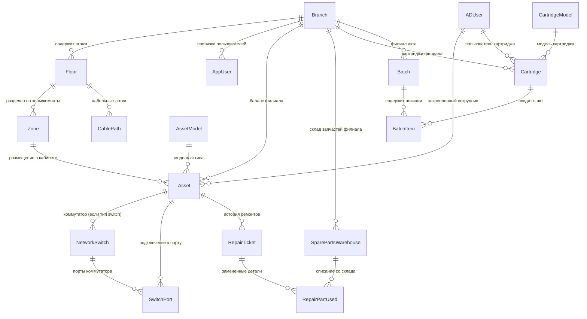

# ПЛАН ЕДИНОЙ БАЗЫ ДАННЫХ (UNIFIED ENTERPRISE DATABASE)
## ДЛЯ ПРОЕКТОВ CARTRIDGE, REPAIR И LOCATION (NETMAP & ITAM)

---

## 1. Архитектурная Концепция Единой БД

### 1.1. Назначение и цель
Все три подсистемы корпоративной IT-инфраструктуры:
1. **CARTRIDGE** — учет, контроль заправки, оборот картриджей, акты передачи и WhatsApp-рассылка;
2. **REPAIR** — учет поломок, отправка техники в сервисные центры, сдача/возврат, акты А4 и автосбор компьютеров из Active Directory;
3. **LOCATION (NetMap & ITAM)** — интерактивная 2D-карта этажей, комнат и коридоров, трассировка кабельных трасс, мониторинг портов коммутаторов (SNMP), управление активами и сервис-деск;

объединяются вокруг **единой базы данных**, расположенной в каталоге `BD/` (`BD/app_unified.db` в режиме SQLite для автономной работы и `PostgreSQL 15+ with PostGIS` в контейнеризированном production-окружении).

### 1.2. Ключевые преимущества единой базы данных
- **Единый Single Sign-On (SSO) и RBAC**: Пользователи системы (`app_users`), роли (`superadmin`, `admin`, `technician`/`operator`, `viewer`/`user`), филиалы (`branches`) и доменные сотрудники (`ad_users`) хранятся в одном экземпляре.
- **Единый реестр активов (Assets / Equipment)**: Компьютеры, собранные из Active Directory, техника, заведенная вручную в REPAIR, и устройства, размещенные на поэтажном плане в LOCATION — это **одни и те же записи в таблице `assets`/`equipment`**.
- **Сквозная прослеживаемость ремонтов**: При отправке ПК в ремонт через карту LOCATION или через список REPAIR создается единая запись тикета/акта, изменяющая статус и на карте (значок гаечного ключа/пульсация), и в реестре техники.
- **Целостность данных**: Внешние ключи (Foreign Keys) и каскадные удаления поддерживаются на уровне СУБД.

---

## 2. СУБД и Стратегия Хранилища

### 2.1. Поддерживаемые движки
1. **Production (Docker Compose)**:
   - **PostgreSQL 15** с расширением **PostGIS 3.3** (`postgis/postgis:15-3.3-alpine`).
   - Используется для пространственных полигонов комнат, трассировки коридоров, сетевых графов, транзакционной надежности и очередей задач.
2. **Local / Portable Development**:
   - **SQLite 3** (`BD/app_unified.db`) с хранением пространственных полигонов и векторов в формате нормализованного JSON (`polygon_coords: JSON`, `path_vectors: JSON`).
   - Позволяет мгновенно запускать систему на рабочих станциях без необходимости поднятия СУБД.

### 2.2. Драйверы и ORM
- **SQLAlchemy 2.0** (asyncpg / psycopg2 для PostgreSQL, aiosqlite / sqlite3 для SQLite).
- **Alembic** для версионирования схемы и миграций в папке `BD/migrations/`.

---

## 3. Полная Структура Таблиц и Схемы Данных



---

### Раздел A: Общее ядро (Shared Core: Аутентификация, Филиалы, Настройки)

#### 1. `branches` (Филиалы и подразделения)
```sql
CREATE TABLE branches (
    id SERIAL PRIMARY KEY,
    name VARCHAR(150) NOT NULL UNIQUE,
    code VARCHAR(50),
    address VARCHAR(255),
    it_office VARCHAR(255),                          -- Кабинет IT-отдела (напр., "Каб. 108")
    network_subnets JSONB DEFAULT '[]'::jsonb,       -- Подсети филиала (CIDR: ["192.168.1.0/24", "10.10.0.0/16"])
    wa_message_template TEXT,                        -- Индивидуальный шаблон WhatsApp для картриджей
    notes TEXT,
    created_at TIMESTAMP WITHOUT TIME ZONE DEFAULT (NOW() AT TIME ZONE 'utc')
);
```

#### 2. `app_users` (Пользователи системы и права доступа)
```sql
CREATE TABLE app_users (
    id SERIAL PRIMARY KEY,
    username VARCHAR(100) NOT NULL UNIQUE,
    full_name VARCHAR(255) NOT NULL,
    password_hash VARCHAR(255),                      -- PBKDF2-HMAC-SHA256 (для локальных)
    auth_type VARCHAR(20) DEFAULT 'local',           -- 'local' | 'ad'
    role VARCHAR(20) DEFAULT 'viewer',               -- 'superadmin', 'admin', 'technician', 'viewer'
    is_active BOOLEAN DEFAULT TRUE,
    branch_id INTEGER REFERENCES branches(id) ON DELETE SET NULL, -- NULL = "Все филиалы"
    wa_instance_name VARCHAR(100),                   -- Персональный инстанс WhatsApp (только для Картриджей)
    created_at TIMESTAMP WITHOUT TIME ZONE DEFAULT (NOW() AT TIME ZONE 'utc')
);
```

#### 3. `ad_users` (Сотрудники организации из Active Directory)
```sql
CREATE TABLE ad_users (
    samaccountname VARCHAR(100) PRIMARY KEY,         -- Логин домена (ivanov)
    display_name VARCHAR(255) NOT NULL,              -- ФИО сотрудника
    department VARCHAR(255),                         -- Подразделение / отдел
    cabinet VARCHAR(100),                            -- Кабинет по данным AD
    phone VARCHAR(100),                              -- Телефон для оповещений
    updated_at TIMESTAMP WITHOUT TIME ZONE DEFAULT (NOW() AT TIME ZONE 'utc')
);
```

#### 4. `system_settings` (Параметры интеграций)
```sql
CREATE TABLE system_settings (
    key VARCHAR(100) PRIMARY KEY,
    value TEXT,
    description VARCHAR(255)
);
```
*Ключи:*
- `ad_host`, `ad_base_dn`, `ad_bind_user`, `ad_bind_password`, `ad_filter`
- `wa_api_url`, `wa_api_key`, `wa_instance_name`, `wa_message_template` (для картриджей)
- `org_name`, `it_office`, `cartridge_act_prefix`, `repair_act_prefix`

---

### Раздел B: Топология и Интерактивная 2D-карта (`LOCATION`)

#### 5. `floors` (Планы этажей)
```sql
CREATE TABLE floors (
    id SERIAL PRIMARY KEY,
    branch_id INTEGER NOT NULL REFERENCES branches(id) ON DELETE CASCADE,
    floor_number INTEGER NOT NULL,                   -- 1, 2, 3 (-1 цоколь)
    name VARCHAR(100),                               -- "1-й этаж, Главный корпус"
    map_image_url VARCHAR(500) NOT NULL,             -- URL/путь к загруженному PNG/SVG
    scale_pixels_per_meter FLOAT DEFAULT 20.0,       -- Масштаб (пикселей на метр)
    width INTEGER NOT NULL,                          -- Ширина изображения
    height INTEGER NOT NULL,                         -- Высота изображения
    created_at TIMESTAMP WITHOUT TIME ZONE DEFAULT (NOW() AT TIME ZONE 'utc')
);
```

#### 6. `zones` (Помещения, кабинеты и коридоры)
```sql
CREATE TABLE zones (
    id SERIAL PRIMARY KEY,
    floor_id INTEGER NOT NULL REFERENCES floors(id) ON DELETE CASCADE,
    name VARCHAR(150) NOT NULL,                      -- "Кабинет 204", "Серверная", "Коридор Север"
    type VARCHAR(50) NOT NULL,                       -- 'office', 'corridor', 'server_room', 'warehouse'
    polygon_coords JSONB NOT NULL,                   -- [{x: 0.12, y: 0.34}, {x: 0.25, y: 0.34}, ...]
    fill_color VARCHAR(30) DEFAULT '#3b82f620',
    border_color VARCHAR(30) DEFAULT '#3b82f6',
    department VARCHAR(255),
    responsible_person VARCHAR(255),
    created_at TIMESTAMP WITHOUT TIME ZONE DEFAULT (NOW() AT TIME ZONE 'utc')
);
```

#### 7. `cable_paths` (Кабельные лотки и коридорные трассы)
```sql
CREATE TABLE cable_paths (
    id SERIAL PRIMARY KEY,
    floor_id INTEGER NOT NULL REFERENCES floors(id) ON DELETE CASCADE,
    name VARCHAR(150),                               -- "Магистраль Коридор Этаж 2"
    path_vectors JSONB NOT NULL,                     -- Массив точек лотка [{x, y}, {x, y}] для графа A*
    max_capacity INTEGER DEFAULT 48,                 -- Макс. количество кабелей в лотке
    current_occupancy INTEGER DEFAULT 0,
    created_at TIMESTAMP WITHOUT TIME ZONE DEFAULT (NOW() AT TIME ZONE 'utc')
);
```

---

### Раздел C: Оборудование, Активы и Сеть (`REPAIR` + `LOCATION`)

#### 8. `asset_models` (Справочник моделей техники)
```sql
CREATE TABLE asset_models (
    id SERIAL PRIMARY KEY,
    name VARCHAR(150) NOT NULL UNIQUE,               -- "HP ProDesk 400 G6 MT"
    vendor VARCHAR(100),                             -- "HP", "Lenovo", "Dell", "Kyocera"
    category VARCHAR(50) NOT NULL,                   -- 'workstation', 'laptop', 'printer', 'server', 'switch', 'monitor', 'ups'
    specs_template JSONB DEFAULT '{}'::jsonb,
    notes TEXT,
    created_at TIMESTAMP WITHOUT TIME ZONE DEFAULT (NOW() AT TIME ZONE 'utc')
);
```

#### 9. `assets` (Единый реестр техники и оборудования)
```sql
CREATE TABLE assets (
    id SERIAL PRIMARY KEY,
    inventory_number VARCHAR(100) NOT NULL UNIQUE,   -- ИНВЕНТАРНЫЙ НОМЕР (главный ключ учета)
    serial_number VARCHAR(100),                      -- Заводской серийный номер S/N
    qr_code VARCHAR(100) UNIQUE,                     -- Штрихкод / QR-код
    hostname VARCHAR(150),                           -- Имя компьютера в Active Directory (PC-BUH-01)
    ad_guid VARCHAR(100),                            -- GUID объекта в AD (для автосбора компьютеров)
    ip_address VARCHAR(45),
    mac_address VARCHAR(50),                         -- MAC (00:1A:2B:3C:4D:5E) для привязки к порту
    asset_type VARCHAR(50) NOT NULL,                 -- 'workstation', 'laptop', 'printer', 'server', 'switch', 'monitor', 'ups', 'other'
    model VARCHAR(150) NOT NULL,
    model_id INTEGER REFERENCES asset_models(id) ON DELETE SET NULL,
    cabinet VARCHAR(100) NOT NULL,                   -- Номер кабинета
    branch_id INTEGER REFERENCES branches(id) ON DELETE SET NULL,
    zone_id INTEGER REFERENCES zones(id) ON DELETE SET NULL, -- Привязка к комнате на карте этажа
    current_user_id VARCHAR(100) REFERENCES ad_users(samaccountname) ON DELETE SET NULL,
    status VARCHAR(50) NOT NULL DEFAULT 'active',    -- 'active', 'pending_vendor', 'at_vendor', 'ready_for_installation', 'decommissioned'
    condition VARCHAR(20) NOT NULL DEFAULT 'working',-- 'working' (В рабочем состоянии) / 'broken' (В нерабочем состоянии)
    coords JSONB,                                    -- {x: 0.452, y: 0.781} - координаты на карте этажа
    specs JSONB DEFAULT '{}'::jsonb,                 -- {cpu: "Core i5-10400", ram: "16GB", os: "Windows 11 Pro"}
    fault_description TEXT,                          -- Заявленная неисправность
    completeness VARCHAR(255),                       -- Комплектность при сдаче
    notes TEXT,
    updated_at TIMESTAMP WITHOUT TIME ZONE DEFAULT (NOW() AT TIME ZONE 'utc')
);

CREATE INDEX idx_assets_inv ON assets(inventory_number);
CREATE INDEX idx_assets_mac ON assets(mac_address);
CREATE INDEX idx_assets_status ON assets(status);
CREATE INDEX idx_assets_condition ON assets(condition);
```

#### 10. `network_switches` (Коммутаторы)
```sql
CREATE TABLE network_switches (
    id SERIAL PRIMARY KEY,
    asset_id INTEGER NOT NULL UNIQUE REFERENCES assets(id) ON DELETE CASCADE,
    ip_address VARCHAR(45) NOT NULL,
    snmp_community VARCHAR(100) DEFAULT 'public',
    snmp_version VARCHAR(10) DEFAULT 'v2c',
    model VARCHAR(150),                              -- "Cisco Catalyst 2960-X", "Eltex MES2324"
    total_ports INTEGER NOT NULL DEFAULT 24,
    created_at TIMESTAMP WITHOUT TIME ZONE DEFAULT (NOW() AT TIME ZONE 'utc')
);
```

#### 11. `switch_ports` (Порты коммутаторов)
```sql
CREATE TABLE switch_ports (
    id SERIAL PRIMARY KEY,
    switch_id INTEGER NOT NULL REFERENCES network_switches(id) ON DELETE CASCADE,
    port_number INTEGER NOT NULL,                    -- 1..48
    port_name VARCHAR(50),                           -- "Gi1/0/12"
    port_speed VARCHAR(20) DEFAULT '1Gbps',
    vlan_id INTEGER DEFAULT 1,
    status VARCHAR(20) DEFAULT 'up',                 -- 'up', 'down', 'disabled'
    connected_asset_id INTEGER REFERENCES assets(id) ON DELETE SET NULL,
    last_mac_seen VARCHAR(50),
    updated_at TIMESTAMP WITHOUT TIME ZONE DEFAULT (NOW() AT TIME ZONE 'utc'),
    CONSTRAINT uq_switch_port UNIQUE (switch_id, port_number)
);
```

---

### Раздел D: Жизненный цикл ремонтов и сервис-деск (`REPAIR` + `LOCATION`)

#### 12. `repair_batches` (Акты передачи оборудования в сервисный центр)
```sql
CREATE TABLE repair_batches (
    id SERIAL PRIMARY KEY,
    act_number VARCHAR(100) NOT NULL UNIQUE,         -- "АКТ-РЕМ-20260925-001"
    vendor_name VARCHAR(255) NOT NULL,               -- Наименование сервисного центра
    branch_id INTEGER REFERENCES branches(id) ON DELETE SET NULL,
    created_at TIMESTAMP WITHOUT TIME ZONE DEFAULT (NOW() AT TIME ZONE 'utc'),
    status VARCHAR(50) DEFAULT 'open',               -- 'open', 'closed'
    notes TEXT
);
```

#### 13. `repairs` (Заявки и позиции на ремонт)
```sql
CREATE TABLE repairs (
    id UUID PRIMARY KEY DEFAULT gen_random_uuid(),
    asset_id INTEGER NOT NULL REFERENCES assets(id) ON DELETE CASCADE,
    batch_id INTEGER REFERENCES repair_batches(id) ON DELETE SET NULL,
    ticket_number VARCHAR(100) NOT NULL UNIQUE,      -- "REP-2026-0001"
    created_by INTEGER REFERENCES app_users(id),
    assigned_technician_id INTEGER REFERENCES app_users(id),
    stage VARCHAR(50) NOT NULL DEFAULT 'diagnostics',-- 'diagnostics', 'waiting_parts', 'in_repair', 'ready_for_installation', 'completed', 'unrepairable_writeoff'
    priority VARCHAR(20) DEFAULT 'medium',           -- 'low', 'medium', 'high', 'critical'
    reported_issue TEXT NOT NULL,                    -- Заявленная неисправность
    diagnostic_result TEXT,                          -- Результат диагностики
    work_performed TEXT,                             -- Выполненные работы
    repair_cost NUMERIC(12, 2) DEFAULT 0.00,         -- Стоимость ремонта по счету СЦ
    temporary_replacement_asset_id INTEGER REFERENCES assets(id) ON DELETE SET NULL, -- Подменный фонд
    started_at TIMESTAMP WITHOUT TIME ZONE,
    completed_at TIMESTAMP WITHOUT TIME ZONE,
    warranty_until TIMESTAMP WITHOUT TIME ZONE,
    created_at TIMESTAMP WITHOUT TIME ZONE DEFAULT (NOW() AT TIME ZONE 'utc')
);
```

#### 14. `spare_parts_warehouse` (Склад комплектующих и запчастей)
```sql
CREATE TABLE spare_parts_warehouse (
    id UUID PRIMARY KEY DEFAULT gen_random_uuid(),
    branch_id INTEGER REFERENCES branches(id) ON DELETE CASCADE,
    category VARCHAR(100) NOT NULL,                  -- 'RAM', 'Storage', 'PowerSupply', 'Cooling', 'Motherboard'
    item_name VARCHAR(255) NOT NULL,                 -- "Kingston Fury 16GB DDR4 3200MHz"
    quantity INTEGER NOT NULL DEFAULT 0,
    min_threshold INTEGER NOT NULL DEFAULT 2,        -- Неснижаемый остаток
    unit_price NUMERIC(12, 2) DEFAULT 0.00,
    created_at TIMESTAMP WITHOUT TIME ZONE DEFAULT (NOW() AT TIME ZONE 'utc')
);
```

#### 15. `repair_parts_used` (Списанные запчасти в рамках ремонта)
```sql
CREATE TABLE repair_parts_used (
    id UUID PRIMARY KEY DEFAULT gen_random_uuid(),
    repair_id UUID NOT NULL REFERENCES repairs(id) ON DELETE CASCADE,
    part_id UUID REFERENCES spare_parts_warehouse(id) ON DELETE SET NULL,
    part_name VARCHAR(255) NOT NULL,
    serial_number VARCHAR(100),
    quantity INTEGER NOT NULL DEFAULT 1,
    cost NUMERIC(12, 2) DEFAULT 0.00,
    installed_at TIMESTAMP WITHOUT TIME ZONE DEFAULT (NOW() AT TIME ZONE 'utc')
);
```

#### 16. `equipment_history_logs` (Аудит-лог истории оборудования)
```sql
CREATE TABLE equipment_history_logs (
    id SERIAL PRIMARY KEY,
    asset_id INTEGER NOT NULL REFERENCES assets(id) ON DELETE CASCADE,
    action VARCHAR(100) NOT NULL,                    -- "Приемка в ремонт", "Передача в СЦ", "Принятие из СЦ", "Установка на рабочее место"
    user_name VARCHAR(255),
    timestamp TIMESTAMP WITHOUT TIME ZONE DEFAULT (NOW() AT TIME ZONE 'utc'),
    details TEXT
);
```

---

### Раздел E: Оборот картриджей (`CARTRIDGE`)

#### 17. `cartridge_models` (Модели картриджей)
```sql
CREATE TABLE cartridge_models (
    id SERIAL PRIMARY KEY,
    name VARCHAR(150) NOT NULL UNIQUE,               -- "HP CE285A (85A)"
    vendor VARCHAR(100),                             -- "HP"
    resource_pages INTEGER,                          -- 1600
    compatible_printers TEXT,
    notes TEXT,
    created_at TIMESTAMP WITHOUT TIME ZONE DEFAULT (NOW() AT TIME ZONE 'utc')
);
```

#### 18. `cartridges` (Реестр картриджей)
```sql
CREATE TABLE cartridges (
    id SERIAL PRIMARY KEY,
    marker_label VARCHAR(100) NOT NULL UNIQUE,       -- "Каб. 204 #1"
    qr_code VARCHAR(100) UNIQUE,
    model VARCHAR(100) NOT NULL,
    cabinet VARCHAR(100) NOT NULL,
    branch_id INTEGER REFERENCES branches(id) ON DELETE SET NULL,
    current_user_id VARCHAR(100) REFERENCES ad_users(samaccountname) ON DELETE SET NULL,
    status VARCHAR(50) NOT NULL DEFAULT 'in_use',    -- 'in_use', 'pending_vendor', 'at_vendor', 'ready_for_pickup'
    condition VARCHAR(20) NOT NULL DEFAULT 'working',-- 'working' / 'broken'
    notes TEXT,
    updated_at TIMESTAMP WITHOUT TIME ZONE DEFAULT (NOW() AT TIME ZONE 'utc')
);
```

#### 19. `batches` (Акты передачи картриджей на заправку)
```sql
CREATE TABLE batches (
    id SERIAL PRIMARY KEY,
    act_number VARCHAR(100) NOT NULL UNIQUE,         -- "АКТ-20260925-001"
    vendor_name VARCHAR(255) NOT NULL,               -- Сервисный центр по заправке
    branch_id INTEGER REFERENCES branches(id) ON DELETE SET NULL,
    created_at TIMESTAMP WITHOUT TIME ZONE DEFAULT (NOW() AT TIME ZONE 'utc'),
    status VARCHAR(50) DEFAULT 'open',
    notes TEXT
);
```

#### 20. `batch_items` (Картриджи в акте передачи)
```sql
CREATE TABLE batch_items (
    id SERIAL PRIMARY KEY,
    batch_id INTEGER NOT NULL REFERENCES batches(id) ON DELETE CASCADE,
    cartridge_id INTEGER NOT NULL REFERENCES cartridges(id) ON DELETE CASCADE,
    action_required VARCHAR(100) DEFAULT 'Заправка'
);
```

#### 21. `cartridge_history_logs` (Аудит-лог картриджей)
```sql
CREATE TABLE cartridge_history_logs (
    id SERIAL PRIMARY KEY,
    cartridge_id INTEGER NOT NULL REFERENCES cartridges(id) ON DELETE CASCADE,
    action VARCHAR(100) NOT NULL,
    user_name VARCHAR(255),
    timestamp TIMESTAMP WITHOUT TIME ZONE DEFAULT (NOW() AT TIME ZONE 'utc'),
    details TEXT
);
```

---

## 4. План Миграции Существующих Данных

1. **Создание структуры в папке `BD/`**:
   - `BD/schema.sql` — чистый DDL дамп всех таблиц.
   - `BD/database.py` — единый движок подключения к SQLite (`BD/app_unified.db`) или PostgreSQL (`DATABASE_URL`).
2. **Перенос существующих данных**:
   - Скрипт `BD/migrate_cartridges_to_unified.py`: перенос существующих таблиц из `CARTRIDGE/data/cartridges.db` в `BD/app_unified.db`.
   - Добавление колонки `condition VARCHAR(20) DEFAULT 'working'` в `cartridges`.
3. **Бесшовное переключение**:
   - Модули `CARTRIDGE`, `REPAIR` и `LOCATION` импортируют `SessionLocal` и `engine` из общего ядра `SHARED/database.py` -> папка `BD/`.

---

## 5. Контрольные Точки Готовности Базы Данных (DoD)
- [x] Создан файл `BD/PLAN.md` со сквозной спецификацией всех 21 таблицы.
- [ ] Развернут файл `BD/app_unified.db` (или PostgreSQL в Docker Compose).
- [ ] Существующие картриджи, пользователи и филиалы успешно перенесены в `BD/`.
- [ ] Созданы индексы по `inventory_number`, `mac_address`, `status`, `condition`.
