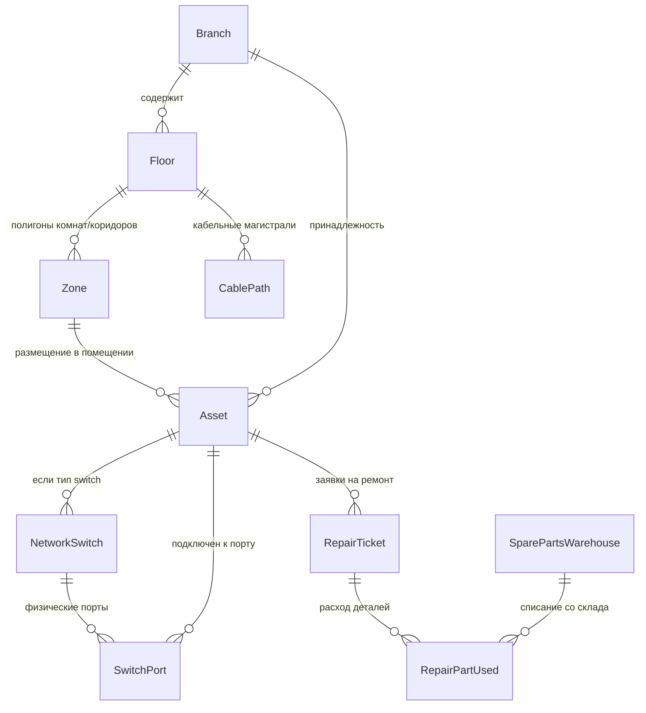
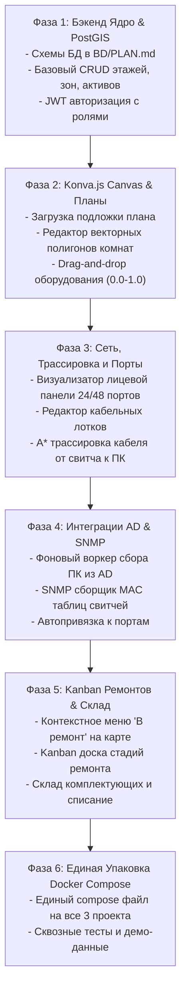

# MISSION & ARCHITECTURAL SPECIFICATION: NETMAP & IT ASSET MANAGEMENT (ITAM)
## ИНТЕРАКТИВНАЯ 2D-КАРТА ОБОРУДОВАНИЯ, ТОПОЛОГИЯ СЕТИ И СЕРВИСНЫЙ ЖИЗНЕННЫЙ ЦИКЛ

---

## 1. Executive Summary & Vision

Проект **NetMap & IT Asset Management (LOCATION)** — это высокопроизводительная корпоративная система визуализации IT-инфраструктуры, поэтажных планов и управления жизненным циклом сетевого и компьютерного оборудования.

Система решает 4 ключевые задачи:
1. **Интерактивная 2D-карта зданий и этажей**: отрисовка векторных полигонов комнат и коридоров, привязка оборудования drag-and-drop с автонормализацией координат $(0.0 - 1.0)$ и динамической анимацией состояния (Online / Offline / In Repair).
2. **Топология сети и трассировка кабельных трасс**: размещение коммутаторов, визуализация лицевых панелей портов (24/48 портов), трассировка кабельных лотков через коридоры по алгоритмам Дейкстры / A*.
3. **Автоматическая инвентаризация (Active Directory + SNMP)**: фоновый воркер собирает объекты компьютеров из AD, опрашивает сетевые коммутаторы по SNMP (Bridge-MIB / ARP) и автоматически сопоставляет MAC-адреса с портами патч-панелей.
4. **Встроенный Service Desk и Kanban ремонтов**: контекстное меню оборудования на карте («Отправить в ремонт»), перевод в статус ремонта со сменой иконки на карте (пульсирующий гаечный ключ), учет запчастей со склада и формирование актов дефектации/списания.

---

## 2. Технологический Стек (Production Stack)

### 2.1. Backend
- **Фреймворк**: **Python 3.11+ / FastAPI** (асинхронная архитектура, Clean Architecture / Domain-Driven Design).
- **База данных**: **PostgreSQL 15** с расширением **PostGIS 3.3** (для пространственных операций, полигонов зон и графов коридоров) в каталоге `BD/`.
- **Очереди задач и кэш**: **Redis 7** + фоновые задачи (Celery / ARQ / FastAPI BackgroundTasks).
- **Сетевые протоколы**: `pysnmp` / `scrapli` для сбора данных с коммутаторов, `ldap3` для Active Directory, `asyncpg` + `SQLAlchemy 2.0`.
- **Real-time транспорт**: **WebSockets** (`/api/v1/ws/floor/{floor_id}`) с вещанием через Redis Pub/Sub.

### 2.2. Frontend & Canvas Engine
- **Фреймворк**: **Vue 3 (Composition API, Pinia, TailwindCSS)** либо **React 18 (Zustand, TailwindCSS, Lucide Icons, Shadcn/ui)**.
- **Canvas Engine**: **Konva.js** (через `vue-konva` или `react-konva`):
  - Аппаратное ускорение (HTML5 Canvas), плавный Pan/Zoom (масштабирование колесом мыши и перетаскивание карты).
  - Векторный редактор полигонов: создание вершин кликами, привязка (snapping) к сетке, перемещение опорных точек.
  - Кастомные спрайты оборудования (ПК, серверы, коммутаторы, МФУ, точки доступа Wi-Fi).
  - Анимированные шейдеры кабельных трасс (бегущие точки пакетов данных).

### 2.3. Инфраструктура и DevOps
- Единый **`docker-compose.yml`** в корне репозитория (сервисы: `gateway-web`, `postgres-postgis`, `redis`, `snmp-worker`, `evolution-api`).
- Репозиторий GitHub: `https://github.com/ZQRey/REP_ZAP_INV.git`.

---

## 3. Архитектура Данных и Модели (Domain Schema)

Все таблицы размещаются в единой базе данных проекта в каталоге `BD/`:



### 3.1. Пространственная иерархия (Spatial)
1. **`branches`**:
   - `id`: Integer PK
   - `name`: String(150), название филиала
   - `address`: String(255)
   - `network_subnets`: JSONB (массив CIDR: `["192.168.10.0/24", "10.20.0.0/16"]`)
2. **`floors`**:
   - `id`: Integer PK
   - `branch_id`: FK -> `branches.id`
   - `floor_number`: Integer (-1, 1, 2, 3...)
   - `map_image_url`: String (PNG/SVG план этажа)
   - `scale_pixels_per_meter`: Float (коэффициент масштабирования, напр. 24.5 px/m)
   - `width`, `height`: Integer
3. **`zones` (Полигоны комнат и коридоров)**:
   - `id`: Integer PK
   - `floor_id`: FK -> `floors.id`
   - `name`: String(150) ("Кабинет 204", "Серверная этажа", "Коридор Запад")
   - `type`: Enum (`office`, `corridor`, `server_room`, `warehouse`)
   - `polygon_coords`: JSONB (нормализованные координаты вершин полигона: `[{"x": 0.12, "y": 0.35}, {"x": 0.28, "y": 0.35}, ...]`)
   - `fill_color`, `border_color`: String (HEX/RGBA)
   - `department`: String
   - `responsible_person`: String
4. **`cable_paths` (Кабельные лотки и коридорные трассы)**:
   - `id`: Integer PK
   - `floor_id`: FK -> `floors.id`
   - `path_vectors`: JSONB (массив узловых точек лотка `[{"x": 0.15, "y": 0.50}, ...]` для алгоритмов поиска пути A*)
   - `max_capacity`: Integer (емкость лотка, напр. 48 кабелей)
   - `current_occupancy`: Integer

### 3.2. Оборудование и сеть (Assets & Networking)
1. **`assets` (Единый реестр техники, общий с модулями REPAIR и CARTRIDGE)**:
   - `id`: Integer PK
   - **`inventory_number`**: String(100) UNIQUE (инвентарный номер организации)
   - `serial_number`: String(100) (заводской номер S/N)
   - `qr_code`: String(100) UNIQUE
   - `hostname`: String(150) (имя ПК в AD, напр. `PC-FIN-03`)
   - `ad_guid`: String(100) (GUID объекта Active Directory)
   - `ip_address`: String(45)
   - `mac_address`: String(50) (MAC адрес для сопоставления с коммутатором)
   - `asset_type`: Enum (`workstation`, `laptop`, `printer`, `server`, `switch`, `wifi_ap`, `monitor`, `ups`, `other`)
   - `status`: Enum (`active`, `offline`, `maintenance`, `in_repair`, `decommissioned`)
   - `condition`: Enum (`working`, `broken`)
   - `coords`: JSONB (`{"x": 0.452, "y": 0.781}` — нормализованные координаты от 0.0 до 1.0)
   - `zone_id`: FK -> `zones.id` (автоматически вычисляется через Point-in-Polygon)
   - `branch_id`: FK -> `branches.id`
   - `current_user_id`: FK -> `ad_users.samaccountname`
   - `specs`: JSONB (`{"cpu": "i7-11700", "ram": "32GB", "disk": "512GB SSD", "os": "Windows 11 Enterprise"}`)
2. **`network_switches`**:
   - `id`: Integer PK
   - `asset_id`: FK -> `assets.id` (коммутатор как физический актив на карте)
   - `ip_address`: String(45)
   - `snmp_community`: String(100)
   - `model`: String(100) ("Cisco Catalyst 2960X-48TS-L", "Eltex MES2428")
   - `total_ports`: Integer (24, 48)
3. **`switch_ports`**:
   - `id`: Integer PK
   - `switch_id`: FK -> `network_switches.id`
   - `port_number`: Integer (1..48)
   - `port_speed`: String ("1Gbps", "10Gbps")
   - `vlan_id`: Integer
   - `status`: Enum (`up`, `down`, `disabled`)
   - `connected_asset_id`: FK -> `assets.id` (какой ПК/принтер подключен к этому порту)
   - `last_mac_seen`: String(50)

### 3.3. Модуль обслуживания и ремонта (Hardware Repair Lifecycle)
1. **`repairs` (Тикеты и акты ремонта)**:
   - `id`: UUID PK
   - `asset_id`: FK -> `assets.id`
   - `ticket_number`: String (напр. `REP-2026-0001`)
   - `created_by`, `assigned_technician_id`: FK -> `app_users.id`
   - `stage`: Enum (`diagnostics`, `waiting_parts`, `in_repair`, `testing`, `completed`, `unrepairable_writeoff`)
   - `priority`: Enum (`low`, `medium`, `high`, `critical`)
   - `reported_issue`: Text (заявленная неисправность)
   - `diagnostic_result`: Text
   - `work_performed`: Text
   - `temporary_replacement_asset_id`: FK -> `assets.id` (выданный подменный ПК/ноутбук)
   - `started_at`, `completed_at`, `warranty_until`: Timestamps
2. **`repair_parts_used`**:
   - `id`: UUID PK
   - `repair_id`: FK -> `repairs.id`
   - `part_name`: String ("Kingston Fury 16GB DDR4", "Блок питания Chieftec 650W")
   - `serial_number`: String
   - `quantity`: Integer
   - `cost`: Decimal(12, 2)
3. **`spare_parts_warehouse` (Склад комплектующих)**:
   - `id`: UUID PK
   - `branch_id`: FK -> `branches.id`
   - `category`: String ("ОЗУ", "Накопители", "Блоки питания", "Кулеры", "Матрицы")
   - `item_name`: String
   - `quantity`: Integer
   - `min_threshold`: Integer (порог оповещения об окончании)
   - `unit_price`: Decimal(12, 2)

---

## 4. Архитектура Функциональных Модулей

```text
+-----------------------------------------------------------------------------------+
|                           VUE 3 / REACT KONVA CANVAS                              |
|  [2D План этажа]  <--> [Векторные полигоны комнат] <--> [Дроп активов (0.0-1.0)]  |
|         ^                                                        ^                |
|         | Трассировка трасс A*                                   | Индикаторы     |
|         v                                                        v                |
|  [Кабельные лотки] <----------------------------------> [Статус: Online/Repair]   |
+-----------------------------------------------------------------------------------+
                                         ^
                                         | WebSocket / REST API
                                         v
+-----------------------------------------------------------------------------------+
|                               FASTAPI ASYNC BACKEND                               |
|  - Router: /floors, /zones, /assets, /network/trace, /repairs                     |
|  - Worker 1: Active Directory LDAP (Компьютеры, GUID, OS, specs)                  |
|  - Worker 2: SNMP Switch Crawler (ARP таблицы -> MAC -> Порт коммутатора)          |
|  - Pathfinding Service: Dijkstra / A* по графу кабельных лотков                   |
+-----------------------------------------------------------------------------------+
                                         ^
                                         | SQLAlchemy 2.0 (PostgreSQL + PostGIS)
                                         v
+-----------------------------------------------------------------------------------+
|                        ЕДИНАЯ БАЗА ДАННЫХ (папка BD/)                             |
|         branches, app_users, assets, switch_ports, repairs, warehouse             |
+-----------------------------------------------------------------------------------+
```

### Модуль 1: Интерактивный Canvas-редактор этажей (Frontend)
1. **Загрузка планов**:
   - Загрузка растровых (PNG, JPG) или векторных (SVG) планов БТИ/архитектурных чертежей.
   - Автоматический расчет пропорций и масштабирования.
2. **Векторный редактор зон (Кабинеты и Коридоры)**:
   - Инструмент рисования полигонов: клик ставит опорную точку, двойной клик замыкает фигуру.
   - Привязка (snapping) к смежным стенам и коридорам.
   - Метаданные зоны: номер кабинета, отдел, ответственный сотрудник.
3. **Drag-and-Drop активов**:
   - Боковая панель: «Неразмещенные устройства» (собранные из AD или SNMP).
   - Перетаскивание иконки устройства прямо на карту в нужную комнату.
   - **Нормализация координат**: координаты сохраняются как $(x, y) \in [0.0, 1.0]$. При любом разрешении экрана или масштабе устройства отображаются строго на своих местах.
4. **Интерактивная панель коммутатора**:
   - Клик на коммутатор на плане открывает модальное окно с визуализацией лицевой панели (24/48 портов RJ-45).
   - Зеленый порт — Link Up, серый — Link Down, оранжевый — подключен ПК в ремонте.
   - Клик на порт подсвечивает подключенное устройство на карте.
5. **Анимированная трассировка кабеля (Pathfinding)**:
   - Клик по компьютеру на карте запускает расчет кратчайшего пути от коммутатора в серверной через кабельные лотки (`cable_paths`) коридоров прямо до розетки в кабинете.
   - Построение графа и анимация движения кабельного сигнала по лоткам.
6. **Визуальные индикаторы в реальном времени**:
   - 🟢 Зеленая точка: Online (пинг проходит).
   - 🔴 Красная точка: Offline (нет ответа).
   - 🟡 Пульсирующий гаечный ключ (Wrench Pulse): устройство находится в статусе `in_repair`. Клик мгновенно открывает тикет ремонта.

### Модуль 2: Фоновые воркеры инвентаризации (Active Directory & SNMP)
1. **LDAP Sync Worker**:
   - Периодический опрос Active Directory контроллеров.
   - Выгрузка компьютеров (`objectClass=computer`): имя хоста, версия ОС, описание, последний вход.
   - Автоматическое создание/обновление записей в таблице `assets`. Новые устройства попадают в пул «Неразмещенных».
2. **SNMP Switch Crawler**:
   - Периодический опрос коммутаторов филиала по протоколам SNMPv2c/v3.
   - Опрос MIB: `dot1dTpFdbTable` (таблица MAC-адресов) и `ipNetToMediaTable` (ARP).
   - Сопоставление: `MAC-адрес ПК -> Порт коммутатора (Gi1/0/14) -> Кабинет на плане`.

### Модуль 3: Сервисный жизненный цикл и Kanban ремонтов
1. **Отправка в ремонт с карты**:
   - Правый клик по устройству на Canvas -> пункт меню **«Отправить в ремонт»**.
   - Статус устройства переключается в `in_repair` (на карте появляется анимация ремонта).
   - Возможность сразу назначить подменный ПК из резервного фонда.
2. **Kanban-доска ремонта**:
   - Колонки: `Диагностика` -> `Ожидание запчастей` -> `В работе` -> `Тестирование` -> `Готово / Выдано`.
   - Карточки тикетов с фото поломок, списком замененных деталей и комментариями техника.
3. **Учет запчастей и списание со склада**:
   - Добавление установленных деталей в тикет ремонта автоматически списывает остаток в `spare_parts_warehouse`.
   - Оповещение при падении остатка ниже неснижаемого порога (`min_threshold`).
4. **Аудит и формирование документов**:
   - Полный таймлайн истории устройства: количество сбоев, замененные узлы, расчет времени наработки на отказ (MTBF).
   - Генерация актов дефектации и списания непригодного оборудования (PDF).

### Модуль 4: Ролевая модель доступа (RBAC)
- **SuperAdmin**: Полный доступ ко всем филиалам, редактирование топологии, удаление, настройки AD и SNMP.
- **BranchAdmin**: Полный доступ в рамках своего филиала (планы, зоны, оборудование).
- **Technician (Техник)**: Доступ к Kanban ремонта, перемещению оборудования на карте, просмотру портов и трассировке.
- **Viewer (Наблюдатель)**: Только просмотр карты, поиск оборудования и проверка статусов.

---

## 5. Спецификация API Контракта (REST & WebSocket)

### 5.1. Аутентификация и Филиалы
- `POST /api/v1/auth/login` — Единый вход (локальный или доменный AD).
- `GET /api/v1/branches/{id}/floors` — Список этажей выбранного филиала.

### 5.2. Поэтажные планы и Зоны
- `POST /api/v1/floors` — Загрузка плана этажа (PNG/SVG, масштаб).
- `GET /api/v1/floors/{id}` — Метаданные этажа и URL подложки.
- `GET /api/v1/floors/{id}/zones` — Список комнат и коридоров с полигонами.
- `POST /api/v1/floors/{id}/zones` — Сохранение нарисованных комнат и полигонов.
- `PUT /api/v1/zones/{id}` — Редактирование геометрии полигона зоны.

### 5.3. Оборудование и Топология
- `GET /api/v1/floors/{id}/assets` — Все размещенные активы этажа с координатами $(x, y)$ и статусами.
- `GET /api/v1/assets/unplaced?branch_id={id}` — Пул неразмещенных устройств (из AD/SNMP).
- `POST /api/v1/assets/{id}/position` — Сохранение нормализованных координат $(x, y)$ и привязки к зоне.
- `GET /api/v1/network/switches/{switch_id}/ports` — Состояние лицевой панели портов коммутатора.
- `GET /api/v1/network/trace?from_switch={id}&to_asset={id}` — Расчет и выдача точек кабельной трассы для анимации на Canvas.

### 5.4. Ремонты и Склад
- `POST /api/v1/repairs` — Создание заявки на ремонт (с карты или реестра), смена статуса актива.
- `GET /api/v1/repairs/kanban?branch_id={id}` — Данные для отображения Kanban-доски.
- `PATCH /api/v1/repairs/{id}/stage` — Перемещение карточки по этапам ремонта.
- `POST /api/v1/repairs/{id}/parts` — Списание запчасти со склада в тикет ремонта.
- `GET /api/v1/warehouse/parts?branch_id={id}` — Остатки комплектующих на складе.

### 5.5. Real-Time WebSockets
- `WS /api/v1/ws/floor/{floor_id}`:
  - События: `asset_status_changed` (Online / Offline), `asset_repair_started`, `asset_moved`, `port_link_changed`.

---

## 6. Пошаговый План Реализации (Phased Roadmap)



### Фаза 1: Бэкенд Ядро & PostGIS
1. Развертывание PostgreSQL 15 + PostGIS в рамках единой базы `BD/`.
2. Описание SQLAlchemy 2.0 моделей для этажей, зон, лотков, коммутаторов и портов.
3. Реализация базовых REST API роутеров для этажей и комнат.

### Фаза 2: Konva.js Canvas Frontend
1. Инициализация фронтенда (Vue 3 + Vite + Pinia + TailwindCSS + Konva.js).
2. Компонент Canvas с поддержкой Pan/Zoom и слоев (слой карты, слой комнат, слой кабелей, слой иконок устройств).
3. Инструмент полигонального рисования помещений с замыканием контура.
4. Боковая панель неразмещенного оборудования с drag-and-drop на карту.

### Фаза 3: Сетевая топология и трассировка
1. Компонент лицевой панели коммутатора (24/48 портов со светодиодами активности).
2. Инструмент прокладки коридорных лотков (`cable_paths`).
3. Алгоритм A* / Дейкстры: автоматический расчет маршрута от коммутатора до розетки ПК и анимированный рендер линии связи на Canvas.

### Фаза 4: Автоматизация (AD + SNMP)
1. Реализация воркера периодического сбора компьютеров из Active Directory через LDAP.
2. Реализация воркера опроса сетевых коммутаторов по SNMP (сбор таблицы Bridge-MIB).
3. Сопоставление IP/MAC адресов и автоматическое определение порта подключения.

### Фаза 5: Сервисный модуль и склад
1. Интеграция контекстного меню «Отправить в ремонт» прямо на карте этажа.
2. Визуальный шейдер/пульсация оборудования на карте при нахождении в ремонте.
3. Kanban-доска стадий ремонта с перемещением карточек.
4. Склад запасных частей и учет использованных деталей.

### Фаза 6: Единый запуск и развертывание
1. Формирование единого `docker-compose.yml` в корне репозитория `https://github.com/ZQRey/REP_ZAP_INV.git`.
2. Загрузка демонстрационного набора данных (1 филиал, 2 этажа с полигонами комнат, 1 коммутатор, компьютеры из AD, 2 активных ремонта).
3. Комплексное тестирование всех систем.
