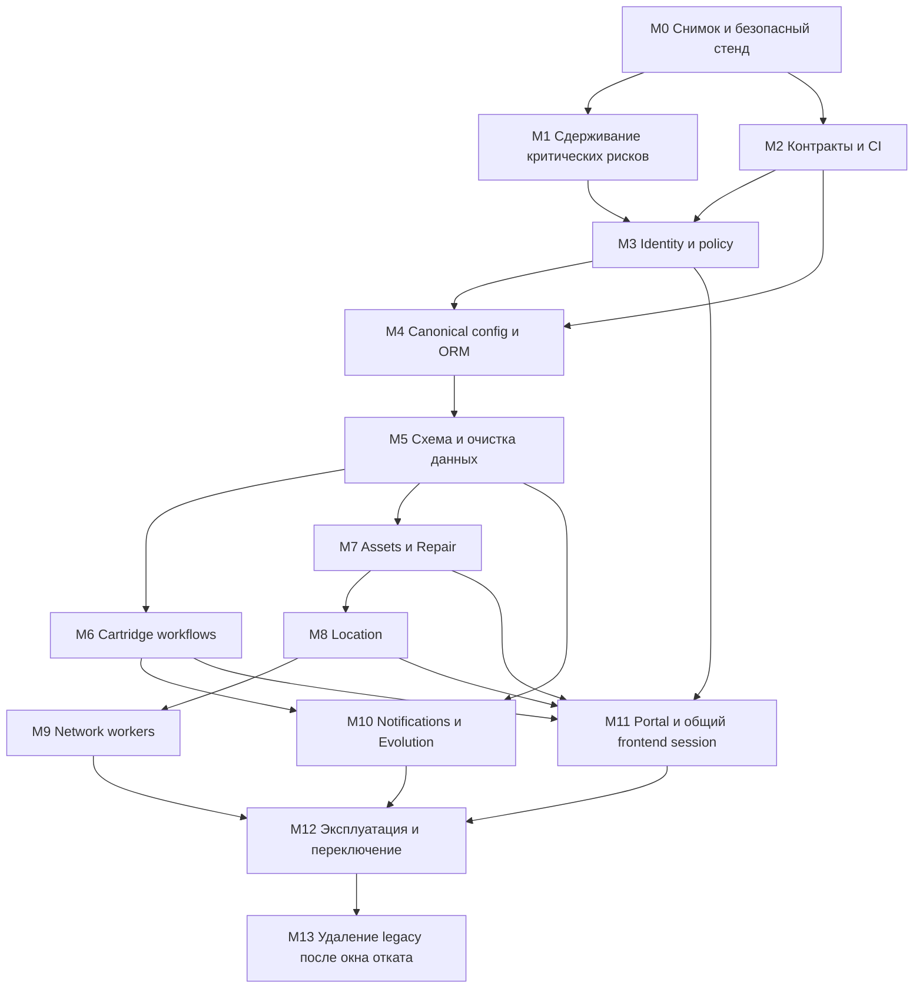

# План полной архитектурной миграции

Основание: аудит `ZQRey/REP_ZAP_INV@ecd7afa17ec1166b1427ca53b041a8e4e360137f`, 28.09.2026. Этот документ — план будущих изменений. Текущий этап создал только документацию; миграции, ротации, refactoring и deployment не выполнялись.

## Подход

Переход выполнять небольшими проверяемыми релизами по схеме expand → migrate → switch → contract. Сохранить FastAPI и модульный монолит, URL и формат данных через adapters. Не совмещать объединение ORM, очистку данных, смену authentication и переписывание frontend в одном релизе. Отдельно согласовать исправления небезопасных контрактов: анонимное чтение, NULL-as-global и передачи JWT в URL нельзя сохранять как требование совместимости.

Владельцы ниже — роли команды, не назначенные люди. Длительности без объёма production-данных и состава команды не обещаются. Для каждого этапа обязательны owner, проверяемый результат, gate и rollback.

## Граф зависимостей

M1 может выпускаться до архитектурных изменений. M6 и M7 могут идти параллельно после M5 при независимых migration revisions и общем владельце metadata. Карты зависят от устойчивой модели активов, network roaming — от карт и membership. WhatsApp зависит от надёжных событий Cartridge и outbox, но не от Repair. LDAP adapter выделяется в M3/M5, автоматический sync включается только после reconciliation identity и branch mapping.

## Этапы и gates

| Этап / owner | Объём и результат | Проверка выхода | Откат / ограничение |
|---|---|---|---|
| M0 — техлид + DBA | Зафиксировать commit, production runtime/image versions, schema-only dump, topology и backups; инвентаризировать legacy standalone и unified установки. Поднять изолированный стенд без реальных адресатов WA/AD/network. Скопировать данные с маскированием. | Проверено восстановление backup; manifest исходных row counts/PK/FK/секретов без значений; согласованы RPO/RTO и ответственные. | Только чтение/копии; исходная production не затрагивается. |
| M1 — security + ops | Ротация Git TLS/JWT/default admin/WA/DB credentials по S01–S04/S17; закрыть прямые host ports, HTTP и публичные business reads. Запретить credential fields в ответах. Отключить production demo/auto-heal; временно ограничить опасные operations до полноценной policy. | Login и emergency admin доступны по TLS; старые secrets не действуют; anonymous reads закрыты на всех aliases; нет password в DTO/logs. | Не возвращать известные secrets или уязвимые endpoint. При аварии maintenance/restrict access. JWT rotation завершит сессии; device/WA rotation требует координации. |
| M2 — QA + platform | Воспроизводимый dependency lock и image, isolated tests; инвентарь URL из матрицы, frontend flows/print/report snapshots. Базовый CI и обязательные проверки PR. | Тесты не достигают production; root и sub-app маршруты учтены; PostgreSQL integration, known failures записаны; secret scan не пропускает ключи. | CI/config rollback без изменения БД; уязвимости не закреплять как expected success. |
| M3 — identity/policy owner | Один Principal, provider identity, membership и deny-by-default scope; схема ролей и permissions. Единый JWT verifier/issuer, auth_type rules, AD TLS/filter escaping. Сначала адаптеры к существующим таблицам, затем расширение identity schema по M5. | Роли × A/B/NULL × own/foreign × bulk × mounted paths проходят negative tests; local/AD collision не повышает права; disabled user не получает доступ. | Feature switch на предыдущую безопасную реализацию; старые identities сохраняются в mapping, автоматический merge запрещён. |
| M4 — backend/platform | Один typed config, Base, engine/get_db, model registry. Explicit imports вместо sys.path и `app.*`. App factory; единственная регистрация business routers, aliases через общий handler. Split input/output DTO. Compatibility mapping settings keys. | Все 9 дублированных ORM-таблиц имеют одного владельца; сравнение DDL/queries; dependency overrides работают для всего приложения; standalone сценарий явно поддержан или заменён документированным запуском. | Старые import paths временно re-export canonical symbols. Не запускать два schema owner; возврат binaries допустим только с совместимой расширенной схемой. |
| M5 — DBA + backend | Alembic baseline для фактических схем; отдельный migrator, убрать runtime DDL/seeds; staging migration, branch/identity remapping, FK/unique/check/time/enum cleanup, PostgreSQL rehearsal. Подробности в DATABASE_MIGRATION_PLAN.md. | Число строк/ID/история/стоимости сверены; orphan=0 либо формальный quarantine; приложение работает с runtime role без DDL; restore и upgrade проверены. | До switch — discard target и повтор; после новых записей — forward fix либо verified reverse replay, не слепой downgrade. |
| M6 — Cartridge owner | Use-cases create/accept/transfer/return/issue; scoped repositories, полная валидация bulk, atomic act counter, разрешённые state transitions, actor audit. Общее чтение/экспорт/печать с той же policy. | Чужой картридж не читается/изменяется; double-submit не создаёт вторую партию; concurrent номера уникальны; отчёты и печать соответствуют бизнес-событиям. | API adapter и feature switch; прежние номера актов/ID не перенумеровывать. |
| M7 — Assets/Repair owner | Выделить authoritative Assets commands; убрать изменения из GET; immutable employee relation, Repair workflows и Decimal cost semantics. Удаление заменить контролируемой архивацией при необходимости retention. Одна реализация switch configuration. | Нет cross-branch IDOR и потери истории; repeated return/install безопасен; одна открытая repair-cycle per asset по принятой политике; сохранены суммы и документы. | Dual-read comparison без dual-write; откат кода возможен на additive schema. Деструктивные delete до решения retention не переносить автоматически. |
| M8 — Location owner | Все floor/zone/asset relations проверяются; чистые GET; управляемые uploads; согласованная модель масштаба/трассировки. Перемещение использует Assets command, а не собственный commit. | A не изменяет карту B; zone.floor и asset.branch согласованы; update/unplace/удаление не оставляют dangling ports; old maps доступны; SVG policy проверена. | Сохранить старые upload files и coordinate fields до верификации; не пересчитывать весь парк без dry-run diff. |
| M9 — integration/network owner | Typed adapters SSH/Omada/SNMP, verified TLS/host keys, inventory-based target allowlist; настоящий SNMP polling либо честное unsupported. Observation store, locks/leases, freshness, dedup, workers и мониторинг. | Ошибка устройства не создаёт fake data; stale/concurrent events не перемещают asset между филиалами; adapter contracts проверены на лаборатории; port uniqueness enforced. | Отключить автоматические перемещения, сохранить observations; manual placement продолжает работать. Demo — только fixtures. |
| M10 — messaging owner | PostgreSQL outbox/delivery ledger; Redis transport с ACL; Evolution отдельные role/database/secrets. Instance ownership/lock, random tokens, явный reset, retries только для безопасных операций. | Foreign recipient selection блокируется; неопределённый send outcome не даёт неконтролируемый повтор; gateway outage/restart восстанавливается; QR не удаляет действующую сессию из-за generic 403. | Pause delivery worker, не replay всю очередь без dedup; rollback provider/DB требует сохранения session state и compatible image. |
| M11 — frontend owner | Общий API/session module, единый logout; убрать URL JWT, принять безопасный auth transport с CSRF policy. Миграция Portal → Cartridge → Repair → Location по одному UI. Locked self-host assets, CSP, доступная обработка 401/403/409. | E2E login/SSO/logout/print/download/uploads/roles; credentials отсутствуют в URL/storage/logs; invalid role не раскрывает данные. | Совместимые страницы через feature flags, но не возвращать URL tokens. API compatibility adapter на время перехода. |
| M12 — ops + QA | Readiness, метрики/alerts/audit retention, backup/restore, resource limits, non-root immutable images, закрытые сервисные сети. Canary и измеряемое переключение. | Все gates M3–M11; agreed error/latency/queue thresholds; бизнес-сверка отчётов; failover и восстановление отрепетированы. | Runbook с ответственным за stop/rollback, fencing единственного writer, сохранением новых данных. |
| M13 — техлид | После оговорённого окна удалить legacy aliases/config/ORM/старые колонки и временные adapters отдельными PR. Обновить эксплуатационные инструкции. | Нет обращений к legacy за окно наблюдения; backup/archive доступен; schema contract migration отдельно проверена. | Это destructive contract-фаза: rollback может потребовать restore/forward migration; не совмещать с M12. |

## Минимальный безопасный первый backlog

1. Isolated fixtures и regression на password-in-response, anonymous print/settings/cartridges, A→B mutation, NULL branch, GET auto-heal.
2. Read DTO без password/community/private extra_params; строгая authentication для бизнес-чтения.
3. Общая Scope dependency; применить также к bulk, reports, print, notifications, Location и Repair aliases. До завершения ограничить наиболее опасные действия.
4. Перестать выдавать JWT через URL; закрыть HTTP/direct ports; выполнить план ротаций с последовательным health-check.
5. Alembic baseline и отключение startup schema changes только после сверки реальной схемы.

Ротацию credentials не откладывать до готовности всего refactor; её журнал и связь с incident response вести вне Git без значений ключей.

## Контрактная политика и критерии приёмки

- URL adapters сохраняют method/path/body/status codes для корректных запросов. Новые 401/403/409 и запрет unsafe GET documented как intentional security fixes. Оба набора mounted/root URL проверяются до снятия aliases.
- NULL-branch users получают понятный отказ и процесс назначения, а не пустое молчаливое «всё доступно». Старые cross-branch batches разбираются отдельно, не пропадают из отчётов без reconciliation.
- Stable AppUser ID и AD identity заменяют сравнение full_name. `user` и `viewer` не сливаются автоматически: права подтверждаются матрицей и владельцем бизнеса.
- Изменение номера акта/даты/финансовой истории запрещено без отдельного migration mapping. Для отчётов фиксируются примеры, counts и totals до/после, включая границы дня/месяца.
- Для каждого P0/P1 есть закрывающий тест. Нельзя закрыть finding только переносом функции в service.
- До production нужен exact dependency/image vulnerability scan, реальные схемы всех инсталляций и результаты восстановления. Текущий AST-аудит не заменяет эти gates.

## Потенциально destructive / трудно обратимые изменения

| Изменение | Почему опасно | Обязательная защита |
|---|---|---|
| Удаление дублей/старых таблиц или колонок | Потеря непрочитанных данных, старый binary не запускается | Expand/contract, usage telemetry, backup и restore rehearsal. |
| Объединение local/AD identities, нормализация логинов | Захват чужой роли, потеря FK/ownership | Immutable ID mapping и ручная очередь конфликтов. |
| Backfill branch, перевод NULL в NOT NULL | Неверный tenant, невидимость записей, блокировки таблиц | Dry-run, owner-approved mapping, quarantine, chunked backfill. |
| Исправление enum/timezone/стоимостей | Изменение смысла истории/итогов | Явное преобразование, контрольные суммы/суммы и отдельные reversible staging fields. |
| SQLite→PostgreSQL switch | Различия enum/JSON/FK/sequence/case; потеря записей при двух writers | Freeze или CDC с high-water mark, reconciliation, fencing. |
| TLS/JWT/DB/WA rotation | Logout, разрыв соединений, повторное pairing WA | Порядок deployment и проверка восстановления доступа; старые secrets не возвращать. |
| Перенос uploads/Evolution state | Потеря карт и WhatsApp sessions | Backup объектов/state, immutable copies, проверка ссылок и владения. |
| Переписывание Git history для ключа | Меняет SHA, ломает клоны/ссылки | Отдельное решение после rotation, координация всех клонов; текущий аудит историю не переписывает. |
| Replay outbox / auto-roaming | Повторные сообщения и ложные физические перемещения | Dedup, provider-result reconciliation, dry-run observation mode. |

Ни одно из этих изменений на этапе аудита не выполнено.
