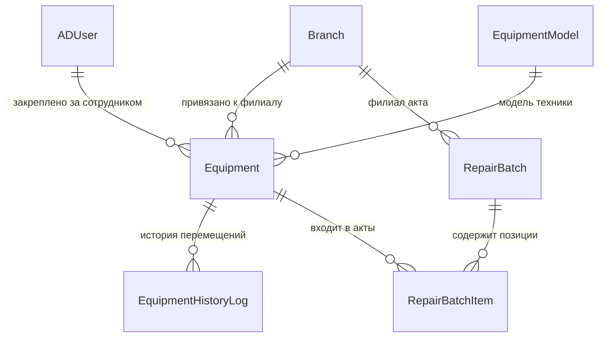
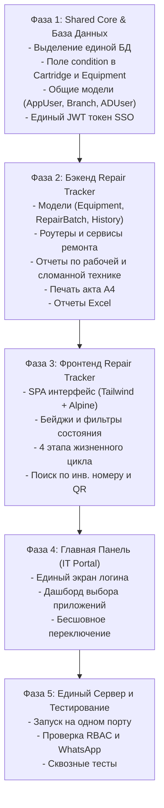

# ПЛАН РЕАЛИЗАЦИИ: СИСТЕМА УЧЕТА И ОТПРАВКИ ТЕХНИКИ В РЕМОНТ (REPAIR TRACKER)
## И ЕДИНАЯ ПАНЕЛЬ АВТОРИЗАЦИИ И ДОСТУПА (UNIFIED IT PORTAL)

---

## 1. Введение и Архитектурная Концепция

### 1.1. Текущее состояние
Проект **Cartridge Tracker** полностью проанализирован (построчно):
- Бэкенд на **FastAPI**, **SQLAlchemy**, **Pydantic v2**, **SQLite** (с поддержкой PostgreSQL).
- Двухфакторная/гибридная аутентификация: **локальная** (PBKDF2-HMAC-SHA256) и **доменная Active Directory (LDAP bind)** с генерацией **JWT-токенов**.
- Ролевая модель доступа (**RBAC**): `superadmin`, `admin`, `operator`, `user` с контекстом **филиалов** (`branches`).
- Интеграция с корпоративным шлюзом **WhatsApp (Evolution API v2)**: режим общего бота (`shared`) и индивидуальных номеров операторов (`individual`), получение QR-кода, проверка статуса сессии.
- Синхронизация сотрудников из **Active Directory** (`displayName`, `physicalDeliveryOfficeName`, `department`, `telephoneNumber`).
- Формирование и печать актов приема-передачи А4 (`window.print`) со строгим ГОСТ-оформлением, подписями Заказчика и Сервисного центра.
- Глубокая аналитика и отчетность: агрегированные данные по периодам (все время, год, месяц, интервал дат) с генерацией стилизованных многостраничных **Excel-книг** (`openpyxl`) и **PDF** (`reportlab`).
- Фронтенд на **Tailwind CSS + Alpine.js** без тяжелых фреймворков (быстрый, отзывчивый SPA), поддержка камеры устройства для сканирования QR-кодов (`html5-qrcode`).

### 1.2. Цель проекта «Техника на ремонт» (Repair Tracker)
Создать надежную, адаптированную систему контроля жизненного цикла ремонта IT-техники и оборудования организации с автоматическим сбором компьютеров из Active Directory.

#### Ключевые требования Заказчика:
1. **Единая база данных проектов (папка `BD/`)**:
   - Все проекты (`CARTRIDGE`, `REPAIR`, `LOCATION`) используют **общую базу данных**, расположенную в каталоге `BD/` корневой директории.
   - Пользователи (`app_users`), права доступа (RBAC), сотрудники AD (`ad_users`), филиалы (`branches`) и системные параметры едины.
2. **Исключение WhatsApp из проекта Ремонта**:
   - **WhatsApp НЕ используется для техники** (он применяется исключительно для оповещения о готовности картриджей).
   - Для техники процесс упрощен и ускорен: осуществляется **отметка о принятии техники из сервисного центра** и **отметка об установке на рабочее место / выдаче сотруднику**.
3. **Автоматический сбор информации о компьютерах из Active Directory**:
   - Система автоматически опрашивает доменные контроллеры AD по LDAP/LDAPS (`objectClass=computer`, `objectCategory=computer`).
   - Собирает параметры: сетевое имя, DNS-имя, операционная система, версия ОС, описание (description), время создания и последнего входа.
   - Компьютеры автоматически регистрируются в реестре как системные блоки, ноутбуки или серверы.
   - **Вся остальная техника (мониторы, МФУ, принтеры, ИБП, коммутаторы, сканеры) вводится вручную** оператором или через импорт.
4. **Единый сервер и Главная панель (IT Portal / Hub)**:
   - Вход в систему перенесен на Главную панель.
   - После успешной авторизации пользователь видит дашборд с выбором системы:
     - 🖨️ **«Картриджи»** (`/cartridges/`)
     - 💻 **«Техника в ремонт»** (`/repair/`)
     - 🗺️ **«Интерактивная карта сети и ITAM»** (`/location/`)
   - Администраторам доступно централизованное управление филиалами, пользователями и интеграцией AD.
5. **Ключевое отличие идентификации**:
   - На технике пишется **ИНВЕНТАРНЫЙ НОМЕР** (вместо надписи маркером).
   - Дополнительно учитывается заводской **Серийный номер (S/N)**, необходимый для гарантии и актов СЦ.
   - Фиксируются: категория техники, неисправность, комплектность, вид ремонта и стоимость.
6. **Учет технического состояния (В рабочем состоянии / В нерабочем состоянии)**:
   - Для техники и картриджей: поле состояния `condition` (`"working"` / `"broken"`).
   - При поломке/сдаче техника маркируется как *"В нерабочем состоянии"*, при принятии из ремонта — *"В рабочем состоянии"*.
7. **Отчёты о рабочей и сломанной технике/картриджах**:
   - Специализированный отчет о состоянии парка (процент исправности, группировка по филиалам, типам и кабинетам).
   - Профессиональный экспорт в **Excel (.xlsx)** с цветовым выделением.
8. **Единый `docker-compose.yml`**:
   - Все приложения и сервисы запускаются совместно через общий docker-compose стек.
   - Единый Git-репозиторий: `https://github.com/ZQRey/REP_ZAP_INV.git`.

---

## 2. Структура Репозитория и Единый Сервер

Проект разделен на логические модули с единой базой данных в папке `BD/`:

```text
REP_ZAP_INV/
├── BD/                                 # ЕДИНАЯ БАЗА ДАННЫХ И ПЛАН РЕАЛИЗАЦИИ БД
│   ├── PLAN.md                         # Детальный план структуры, связей и миграций БД
│   └── app_unified.db                  # Общий файл БД SQLite / скрипты для PostgreSQL
├── CARTRIDGE/                          # Модуль учета и оборота картриджей
│   ├── app/
│   │   ├── routers/                    # Приемка, акты, выдача, WhatsApp рассылка
│   │   ├── services/                   # whatsapp_service, report_service...
│   │   ├── templates/act_print.html    # Печатная форма акта передачи картриджей
│   │   └── static/ (index.html, app.js, css)
│   └── ...
├── REPAIR/                             # Модуль ремонта техники
│   ├── PLAN.md                         # Настоящий утвержденный план
│   ├── app/
│   │   ├── routers/
│   │   │   ├── equipment_router.py     # Приемка, установка, поиск по инв. №, CRUD
│   │   │   ├── ad_computers_router.py  # Сбор и синхронизация компьютеров из AD
│   │   │   ├── repair_batches_router.py# Формирование актов передачи в СЦ
│   │   │   ├── equipment_models_router.py # Справочник моделей техники
│   │   │   ├── repair_print_router.py  # Печатная форма акта А4 передачи техники
│   │   │   └── repair_reports_router.py# Аналитика и Excel экспорт по ремонтам
│   │   ├── services/
│   │   │   ├── ad_computer_service.py  # Опрос Active Directory на компьютеры
│   │   │   └── repair_report_service.py# Генерация отчетов Excel/PDF
│   │   ├── templates/repair_act_print.html # Акт передачи оборудования в ремонт
│   │   └── static/ (index.html, repair-app.js, css)
│   └── ...
├── LOCATION/                           # Модуль NetMap & IT Asset Management (ITAM)
│   ├── PLAN.md                         # Полный архитектурный план 2D-карты и ITAM
│   ├── app/ (бэкенд топологии, Konva.js фронтенд, трассировка кабелей, SNMP)
│   └── ...
├── SHARED/                             # Общее ядро: База данных, Аутентификация, AD, Филиалы
│   ├── database.py                     # Подключение к единой БД в /BD/
│   ├── models_common.py                # AppUser, Branch, ADUser, SystemSetting
│   ├── auth_service.py                 # Единый сервис авторизации и JWT SSO
│   └── ldap_service.py                 # Базовая синхронизация Active Directory
├── PORTAL/                             # Главная панель (IT Portal Hub)
│   ├── static/
│   │   ├── portal.html                 # Единый экран входа и переключения систем
│   │   └── portal.js                   # Авторизация и быстрый запуск модулей
├── main_server.py                      # ЕДИНЫЙ FastAPI сервер (монтирует Portal, Cartridge, Repair, Location)
├── Dockerfile                          # Единый контейнер сборки
├── docker-compose.yml                  # Единый Docker Compose стек для всех приложений
└── requirements.txt                    # Единый список зависимостей
```

---

## 3. Архитектура Единой Базы Данных (папка `BD/`)

Все приложения обращаются к **одной общей базе данных** в папке `BD/` (`BD/app_unified.db` или PostgreSQL). Полное описание моделей и связей зафиксировано в [`BD/PLAN.md`](file:///c:/Users/zqrey3/Desktop/Scritps/Python/Cartridge_Refilling/BD/PLAN.md).

### 3.1. Общие таблицы (Shared Core)

1. **`branches` (Филиалы компании)**:
   - `id`: Integer PK
   - `name`: String(150), уникальное название ("Центральный офис", "Филиал Север", "Склад")
   - `code`: String(50), краткий код
   - `address`: String(255)
   - `it_office`: String(255), кабинет IT-отдела (напр., "Кабинет 108")
   - `wa_message_template`: Text, индивидуальный шаблон WhatsApp при выдаче
   - `notes`: Text, заметки

2. **`app_users` (Пользователи системы с правами доступа)**:
   - `id`: Integer PK
   - `username`: String(100), уникальный логин
   - `full_name`: String(255), ФИО оператора/администратора
   - `password_hash`: String(255), хэш PBKDF2 (для локальных)
   - `auth_type`: String(20), `"local"` или `"ad"`
   - `role`: String(20), `"superadmin"` | `"admin"` | `"operator"` | `"user"`
   - `is_active`: Boolean
   - `branch_id`: FK -> `branches.id` (None = доступ ко всем филиалам)
   - `wa_instance_name`: String(100), персональный инстанс WhatsApp оператора
   - `created_at`: DateTime

3. **`ad_users` (Сотрудники организации из Active Directory)**:
   - `samaccountname`: String(100) PK
   - `display_name`: String(255), ФИО сотрудника
   - `department`: String(255), отдел
   - `cabinet`: String(100), кабинет
   - `phone`: String(100), телефон для WhatsApp
   - `updated_at`: DateTime

4. **`system_settings` (Системные настройки)**:
   - Ключ-значение: параметры LDAP, WhatsApp шлюза, наименование организации, префиксы актов.

---

### 3.2. Таблицы для Ремонта Техники (`REPAIR`) и расширение Картриджей

> **Важно**: В обе системы добавляется единое поле технического состояния `condition` (`"working"` / `"broken"`):
> - `cartridges.condition`: `"working"` (*В рабочем состоянии*) / `"broken"` (*В нерабочем состоянии*).
> - `equipment.condition`: `"working"` (*В рабочем состоянии*) / `"broken"` (*В нерабочем состоянии*).



1. **`equipment_models` (Справочник моделей техники)**:
   - `id`: Integer PK
   - `name`: String(150), уникальное название (напр. "HP ProDesk 400 G6 MT", "Lenovo ThinkCentre M720q", "Dell P2419H", "HP LaserJet Pro M428fdn", "APC Smart-UPS 1500VA")
   - `vendor`: String(100), производитель (HP, Dell, Lenovo, Canon, Kyocera, APC, Asus, Acer, Samsung)
   - `equipment_type`: String(100), категория (Системный блок, Ноутбук, Монитор, МФУ, Принтер, ИБП, Сетевое оборудование, Сканер, Терминал)
   - `notes`: Text, особенности обслуживания/гарантии

2. **`equipment` (Единица техники / Оборудование)**:
   - `id`: Integer PK
   - **`inventory_number`**: String(100) UNIQUE INDEX NOT NULL — **Главный идентификатор** (инвентарный номер организации)
   - `serial_number`: String(100) INDEX, заводской серийный номер S/N (производителя)
   - `qr_code`: String(100) UNIQUE INDEX, штрихкод / QR-код инвентарника
   - `equipment_type`: String(100) NOT NULL, тип техники
   - `model`: String(150) NOT NULL, модель техники
   - `cabinet`: String(100) NOT NULL, кабинет/помещение
   - `status`: Enum(`in_use`, `pending_vendor`, `at_vendor`, `ready_for_pickup`, `unrepairable`) — этап жизненного цикла
   - **`condition`**: String(20), Enum(`working`, `broken`), default=`working`, index=True — **Техническое состояние: «В рабочем состоянии» / «В нерабочем состоянии»**
   - `branch_id`: FK -> `branches.id`
   - `current_user_id`: FK -> `ad_users.samaccountname` (ответственный сотрудник)
   - `fault_description`: Text, текущая или последняя заявленная неисправность
   - `completeness`: String(255), комплектность (напр. "Системный блок, шнур питания", "Ноутбук + блок питания + сумка")
   - `notes`: Text, примечания
   - `updated_at`: DateTime

3. **`repair_batches` (Акты передачи техники в сервисный центр)**:
   - `id`: Integer PK
   - `act_number`: String(100) UNIQUE NOT NULL (напр. `АКТ-РЕМ-20260925-001`)
   - `vendor_name`: String(255) NOT NULL, название сервисного центра/подрядчика
   - `branch_id`: FK -> `branches.id`
   - `created_at`: DateTime
   - `status`: String(50), `"open"` | `"closed"`
   - `notes`: Text

4. **`repair_batch_items` (Позиции оборудования в акте)**:
   - `id`: Integer PK
   - `batch_id`: FK -> `repair_batches.id` (ON DELETE CASCADE)
   - `equipment_id`: FK -> `equipment.id` (ON DELETE CASCADE)
   - `fault_description`: Text, заявленная неисправность на момент отправки
   - `completeness`: String(255), комплектность
   - `action_required`: String(100), требуемый вид работ ("Диагностика", "Компонентный ремонт", "Замена комплектующих", "Техническое обслуживание", "Акт дефектации")
   - `repair_cost`: Float / Numeric, согласованная или итоговая стоимость ремонта

5. **`equipment_history_logs` (Полный аудит-лог техники)**:
   - `id`: Integer PK
   - `equipment_id`: FK -> `equipment.id` (ON DELETE CASCADE)
   - `action`: String(100), действие ("Приемка в ремонт", "Передача в СЦ", "Возврат из СЦ", "Выдача в работу", "Списание", "Редактирование")
   - `user_name`: String(255), инициатор / сотрудник
   - `timestamp`: DateTime
   - `details`: Text, подробный лог (неисправность, номер акта, СЦ, стоимость, кабинет)

---

## 4. Главная Панель (IT Portal) и Single Sign-On (SSO)

### 4.1. Сценарий входа и маршрутизации
1. Пользователь открывает адрес сервера: `http://server:8080/`.
2. Если JWT-токен отсутствует или истек:
   - Отображается экран входа единого IT-портала.
   - Поддерживаются методы: **Локальный вход** и **Active Directory (доменный логин/пароль)**.
3. После успешного входа:
   - Пользователь перенаправляется на **Главную Панель Выбора**:
     ```text
     +---------------------------------------------------------------------------------+
     |  IT Service Desk Portal | Филиал: Главный офис | Иванов И.И. (Оператор) | Выход |
     +---------------------------------------------------------------------------------+
     |                                                                                 |
     |   Выберите систему для работы:                                                  |
     |                                                                                 |
     |   +---------------------------------+   +---------------------------------+     |
     |   |       🖨️ КАРТРИДЖИ              |   |       💻 ТЕХНИКА И РЕМОНТ       |     |
     |   |                                 |   |                                 |     |
     |   | - Учет заправок и оборота       |   | - Отправка оборудования в СЦ    |     |
     |   | - Акты передачи поставщику      |   | - Инвентарные и серийные номера |     |
     |   | - WhatsApp оповещение о готовых |   | - Контроль поломок и стоимости  |     |
     |   | - Очередь: 4 ожидают            |   | - Очередь: 2 в ремонте          |     |
     |   |                                 |   |                                 |     |
     |   |      [ Войти в Картриджи ]      |   |        [ Войти в Ремонт ]       |     |
     |   +---------------------------------+   +---------------------------------+     |
     |                                                                                 |
     |   [Панель Администратора] (только для admin / superadmin):                      |
     |   * Пользователи и права   * Филиалы   * Active Directory   * WhatsApp Шлюз     |
     +---------------------------------------------------------------------------------+
     ```
4. При переходе в **«Картриджи»** (`/cartridges/`) или **«Технику»** (`/repair/`):
   - JWT-токен бесшовно передается и валидируется.
   - В верхней шапке каждого приложения присутствует кнопка: **«⮌ Главная панель»**, позволяющая переключиться между системами без повторной авторизации.

---

## 5. Детальный Жизненный Цикл Техники (4 Этапа)

### 5.1. Этап 1: Приемка оборудования в ремонт
- **Поиск**:
  - Оператор вводит **Инвентарный номер** (например, `ИНВ-104052`) или сканирует штрихкод/QR камерой устройства.
  - Если оборудование уже есть в базе — автоматически подтягиваются: Тип техники, Модель, Заводской серийный номер, Кабинет и Закрепленный сотрудник из AD.
  - Если новое — оператор указывает Модель (из выпадающего справочника с автодополнением или вводом новой), Серийный номер и Кабинет.
- **Ввод неисправности**:
  - Быстрый выбор частых неисправностей (клише: *"Не включается"*, *"Артефакты/нет изображения"*, *"Не загружается ОС"*, *"Посторонний шум/перегрев"*, *"Механическое повреждение"*, *"Замятие бумаги/дефект печати"*).
  - Свободное текстовое поле для детального описания неисправности со слов пользователя.
  - Поле **«Комплектность»** (*"Только системный блок"*, *"С блоком питания и кабелем HDMI"*, *"Без проводов"*).
- **Сотрудник**:
  - Автопоиск по Active Directory по фамилии с отображением отдела, кабинета и контактного телефона.
- **Действие**:
  - Кнопка **«Принять в ремонт»** -> статус меняется на `pending_vendor` (*Ожидает отправки в СЦ*), а техническое состояние автоматически переключается в **`condition = "broken"` («В нерабочем состоянии»)**.
  - *(Аналогично в Картриджах: при сдаче картриджа с дефектом или на перезаправку он помечается как «В нерабочем состоянии»)*.
  - Запись в журнал истории: дата/время, оператор, состояние поломки и неисправность.

### 5.2. Этап 2: Формирование Акта передачи в Сервисный Центр
- Переход во вкладку **«2. Акт передачи в СЦ»**.
- Отображается таблица оборудования, ожидающего отправки (`pending_vendor`).
- Фильтрация по филиалу оператора.
- Выбор чекбоксами позиций для передачи курьеру/представителю сервисного центра.
- Выбор или ввод Сервисного Центра (подрядчика) и требуемого типа работ (Диагностика, Компонентный ремонт, Профилактика).
- Кнопка **«Сформировать акт передачи оборудования и распечатать»**:
  - Генерируется уникальный номер: `АКТ-РЕМ-YYYYMMDD-XXX`.
  - Оборудование переходит в статус `at_vendor` (*В ремонте в СЦ*), сохраняя состояние `broken` (*«В нерабочем состоянии»*).
  - Автоматически открывается печатная страница формата А4 (`window.print`).

#### Печатная форма А4 («Акт приема-передачи оборудования на диагностику/ремонт»):
- Шапка с официальным наименованием Заказчика (`org_name`) и реквизитами филиала (`it_office`).
- Номер и дата акта русскими буквами (*«25» сентября 2026 г.*).
- Наименование Исполнителя (Сервисный центр).
- Четкая табличная часть:
  1. № п/п
  2. **Инвентарный номер**
  3. **Серийный номер (S/N)**
  4. **Тип и Наименование/Модель оборудования**
  5. **Комплектность при сдаче**
  6. **Заявленная неисправность**
  7. **Требуемые работы / Примечание**
- Пункт об ответственности и сохранности материальных ценностей.
- Блоки подписей: «Сдал от Заказчика» и «Принял от Исполнителя (СЦ)».

### 5.3. Этап 3: Возврат из СЦ и Принятие в IT-отделе (Без WhatsApp)
- Курьер сервисного центра привозит отремонтированную технику.
- Переход во вкладку **«3. Возврат из СЦ»**.
- Таблица оборудования, находящегося в ремонте (`at_vendor`).
- Отметка позиций, которые вернулись:
  - Возможность внести результат ремонта (*"Заменен блок питания"*, *"Перепаян разъем питания"*, *"Заменен ролик захвата бумаги"*).
  - Поле для фиксации стоимости ремонта по счету СЦ (для последующих отчетов).
  - **Выбор результата состояния**:
    - **Отремонтировано успешно**: кнопка **«Принять из СЦ (Готово к установке)»** -> фиксируется дата возврата, статус переходит в `ready_for_installation` (*Готово к установке / выдаче*), состояние становится **`condition = "working"` («В рабочем состоянии»)**.
    - **Неремонтопригодно / Акт дефектации**: опция списания -> статус `unrepairable` и состояние остается **`condition = "broken"` («В нерабочем состоянии»)**.
- **WhatsApp не используется**: никаких внешних сообщений не отправляется, информация моментально обновляется в единой базе.

### 5.4. Этап 4: Установка на рабочее место / Выдача сотруднику
- Специалист IT-отдела производит установку оборудования на рабочее место в кабинете сотрудника либо выдает аппарат сотруднику на руки.
- Вкладка **«4. Установка и Выдача»**: ввод инвентарного номера или сканирование QR.
- Система показывает данные: модель, серийный номер, целевой кабинет, ФИО ответственного из AD, выполненные работы и подтвержденное рабочее состояние.
- Кнопка **«Установлено на рабочее место / Выдано»** -> статус переходит в `in_use` (*В работе / В эксплуатации*), состояние `working`.
- В аудит-лог вносится запись: *"Оборудование успешно установлено в каб. {cabinet}, ответственный: {user_name}"*.

### 5.5. Автоматический сбор компьютеров из Active Directory
- Вкладка **«Синхронизация с AD»** в модуле Ремонта:
  - Кнопка **«Собрать компьютеры из Active Directory»**.
  - Фоновый процесс отправляет LDAP-запрос к доменному контроллеру:
    `(&(objectCategory=computer)(objectClass=computer)(!(userAccountControl:1.2.840.113556.1.4.803:=2)))`
  - Извлекаются атрибуты каждого ПК:
    - `name` / `sAMAccountName` (сетевое имя хоста, напр. `PC-BUH-01`, `SRV-APP`)
    - `dNSHostName` (полное DNS имя)
    - `operatingSystem` и `operatingSystemVersion` (напр. Windows 11 Pro, Windows 10 Enterprise)
    - `description` (описание из AD, часто содержит инвентарный номер или ФИО)
    - `whenCreated` и `lastLogonTimestamp`
  - Оборудование автоматически создается в базе:
    - Тип техники: Системный блок / Ноутбук / Сервер (определяется по имени/ОС).
    - Модель: формируется на основе данных AD либо назначается оператором.
    - Инвентарный номер: извлекается из `description` (если указан) либо проставляется оператором в один клик.
    - Состояние по умолчанию: `working` (*В рабочем состоянии*).
  - **Вся остальная техника (мониторы, МФУ, принтеры, ИБП, сканеры, терминалы) вносится оператором вручную** через форму или реестр.

### 5.6. Реестр оборудования и картриджей
- В обоих интерфейсах (Реестр картриджей и Реестр техники) выводятся:
  - Визуальный бейдж технического состояния: 🟢 **«В рабочем состоянии»** / 🔴 **«В нерабочем состоянии»**.
  - Быстрые фильтры в один клик: **Все | Только рабочие | Только сломанные**.
  - Возможность ручного переключения состояния оператором (например, если техника/картридж сломались на рабочем месте до отправки в СЦ).

---

## 6. Отчетность и Аналитика по Ремонтам и Картриджам (Excel и PDF)

Модуль отчетов реализует глубокую аналитику как для Картриджей, так и для Техники:

1. **Типы выборки**:
   - За всё время (`all`)
   - За текущий год (`year`)
   - За конкретный месяц (`month`)
   - За произвольный период дат (`custom`: `date_from` -> `date_to`)
   - Фильтрация по выбранному филиалу либо сводный отчет по всей организации.

2. **Специализированный блок: «Отчёт о рабочей и сломанной технике / картриджах»**:
   - **Метрики готовности парка**:
     - Общее количество единиц на балансе/в учете.
     - 🟢 **В рабочем состоянии**: точное количество и % исправности фонда.
     - 🔴 **В нерабочем состоянии**: точное количество и % неисправного фонда (на ремонте, ожидает отправки, дефектация).
   - **Группировка и срезы**:
     - *По филиалам*: сравнение надежности и уровня поломок между подразделениями.
     - *По типам оборудования* (для техники): процент исправности ноутбуков, системных блоков, мониторов, МФУ.
     - *По моделям* (для картриджей и техники): выявление проблемных серий оборудования и картриджей.
     - *По кабинетам и сотрудникам*: реестр мест, где находится сломанная техника, ожидающая действий IT.
   - **Реестр сломанных позиций**: табличный перечень оборудования/картриджей с дефектами с указанием инвентарного номера, модели, заявленной поломки и ответственного лица.

3. **Общие аналитические блоки ремонта**:
   - **Сводка**: Всего техники в компании, в эксплуатации, на ремонте, готово к выдаче, списано.
   - **Статистика поломок по типам**: Ноутбуки, Системные блоки, Принтеры/МФУ, Мониторы (какая категория ломается чаще).
   - **Топ моделей по отказам**: выявление ненадежных партий оборудования.
   - **Статистика по сервисным центрам и затратам**: количество ремонтов и общая сумма затрат на ремонт за период.
   - **Повторные ремонты по инвентарным номерам**: аппараты, попадавшие в сервис более 2-х раз за год.

4. **Формирование файлов Excel (.xlsx)**:
   - Генерация через `openpyxl` с фирменным стилем: синий корпоративный заголовок, автоширина колонок, границы, форматирование денежных сумм и дат.
   - Разделение на вкладки книги:
     - Лист 1: *«Сводная статистика и затраты»*
     - Лист 2: *«Рабочая и сломанная техника»* (Сводные таблицы исправности по типам и филиалам + условное форматирование: зеленый для рабочих, красный для неисправных)
     - Лист 3: *«Реестр оборудования»* (Инв. №, S/N, Состояние, Тип, Модель, Кабинет, Сотрудник, Кол-во ремонтов)
     - Лист 4: *«Журнал ремонтов»* (Дата, Акт, Инв. №, СЦ, Неисправность, Выполненные работы, Стоимость)
   - *(Для Картриджей: аналогично формируется лист «Рабочие и нерабочие картриджи» с подсчетом ресурса и циклов заправок)*.

---

## 7. Спецификация API Эндпоинтов

### 7.1. Общие сервисы (Portal & Shared)
| Метод | Путь | Описание | Доступ |
|---|---|---|---|
| `POST` | `/api/auth/login` | Единая авторизация (Local / Active Directory) | Публичный |
| `GET` | `/api/auth/me` | Данные текущего профиля, роли и филиала | Авторизован |
| `GET` | `/api/branches` | Список филиалов организации | Авторизован |
| `POST/PUT/DELETE` | `/api/branches` | Управление филиалами | Admin / Superadmin |
| `GET/POST/PUT/DELETE` | `/api/app-users` | Управление пользователями и ролями | Superadmin |
| `POST` | `/api/settings/ldap/sync` | Синхронизация сотрудников из Active Directory | Superadmin |
| `GET/POST` | `/api/settings/wa/*` | Статус, QR-код, привязка WhatsApp сессий | Operator / Superadmin |
| `GET` | `/api/users/search` | Живой автокомплит сотрудников AD по ФИО | Operator / Admin |

### 7.2. Модуль Ремонта Техники (`/api/repair/*`)
| Метод | Путь | Описание | Доступ |
|---|---|---|---|
| `GET` | `/api/repair/equipment` | Список техники с фильтрами по статусу, состоянию (working/broken), типу, филиалу | Operator / User |
| `GET` | `/api/repair/equipment/search/quick` | Быстрый поиск по инвентарному номеру / QR / S/N | Operator |
| `GET` | `/api/repair/equipment/{id}` | Полная карточка техники с историей ремонтов | Operator / User |
| `POST` | `/api/repair/equipment` | Заведение новой единицы техники (с выбором состояния) | Operator |
| `PUT` | `/api/repair/equipment/{id}` | Редактирование параметров техники | Operator |
| `PATCH` | `/api/repair/equipment/{id}/condition` | Быстрое переключение состояния (В рабочем / В нерабочем) | Operator |
| `DELETE` | `/api/repair/equipment/{id}` | Удаление техники из реестра | Admin |
| `POST` | `/api/repair/equipment/accept` | **Этап 1: Приемка в ремонт** (автоперевод в condition='broken') | Operator |
| `POST` | `/api/repair/equipment/return-vendor` | **Этап 3: Возврат из СЦ и Принятие в IT** (фиксация работ, стоимости, working/broken, без WA) | Operator |
| `POST` | `/api/repair/equipment/{id}/install` | **Этап 4: Установка на рабочее место / Выдача** (перевод в in_use) | Operator |
| `POST` | `/api/repair/equipment/bulk-install` | Массовая отметка об установке на рабочие места | Operator |
| `GET` | `/api/repair/batches` | Реестр актов передачи техники в СЦ | Operator |
| `GET` | `/api/repair/batches/{id}` | Детали акта со списком позиций | Operator |
| `POST` | `/api/repair/batches` | **Этап 2: Создание акта передачи в СЦ** и смена статусов | Operator |
| `GET` | `/api/repair/models` | Справочник моделей техники | Operator |
| `POST/PUT/DELETE` | `/api/repair/models` | Управление справочником моделей техники | Admin |
| `POST` | `/api/repair/ad/computers/sync` | **Запуск сбора и синхронизации ПК из Active Directory** | Operator / Admin |
| `GET` | `/api/repair/ad/computers` | Список обнаруженных компьютеров из AD | Operator |
| `GET` | `/print/repair/act/{batch_id}` | Печатная форма А4 акта передачи оборудования в СЦ | Operator |
| `GET` | `/api/repair/reports/data` | JSON-данные сводного отчета по ремонтам | Operator |
| `GET` | `/api/repair/reports/condition` | **JSON-данные отчета о рабочей и сломанной технике** | Operator |
| `GET` | `/api/repair/reports/export/excel` | Скачивание отчета по ремонтам и состоянию в Excel (.xlsx) | Operator |

### 7.3. Дополнения для Модуля Картриджей (`/api/cartridges/*`)
| Метод | Путь | Описание | Доступ |
|---|---|---|---|
| `PATCH` | `/api/cartridges/{id}/condition` | Быстрое переключение состояния картриджа (В рабочем / В нерабочем) | Operator |
| `GET` | `/api/reports/condition` | **JSON-данные отчета о рабочих и нерабочих картриджах** | Operator |
| `GET` | `/api/reports/export/excel?report_type=condition` | Скачивание листа Excel с анализом исправности картриджного фонда | Operator |

---

## 8. Пошаговый План Реализации (Фазы)



### Фаза 1: Shared Core и Единая База Данных
1. Сформировать общий модуль `SHARED` с единым `engine` SQLAlchemy и общей таблицей `system_settings`, `branches`, `app_users`, `ad_users`.
2. Обновить схему картриджей: добавить поле `condition` (`"working"` / `"broken"`).
3. Обновить авторизацию: токен JWT содержит единые клеймы (`sub`, `role`, `branch_id`), подходящие для обоих приложений.
4. Проверить обратную совместимость существующей базы `cartridges.db` (миграция в единую схему).

### Фаза 2: Бэкенд модуля Repair Tracker и Отчетов
1. Создать модели `Equipment` (с полями `inventory_number`, `serial_number`, `condition`), `EquipmentModel`, `RepairBatch`, `RepairBatchItem`, `EquipmentHistoryLog`.
2. Реализовать Pydantic схемы валидации.
3. Реализовать роутеры:
   - `equipment_router.py`: приемка по инвентарному номеру, отметка об установке на рабочее место, возврат из СЦ, переключение состояния `condition`.
   - `ad_computers_router.py` + `ad_computer_service.py`: опрос Active Directory, обнаружение и автосоздание компьютеров (ПК, ноутбуки, серверы).
   - `repair_batches_router.py`: формирование актов передачи в СЦ с генерацией номера `АКТ-РЕМ-...`.
   - `repair_print_router.py` + Jinja2 шаблон `repair_act_print.html` (формат А4 для техники).
   - `repair_reports_router.py` + `repair_report_service.py` (аналитика и Excel: общие ремонты + отчет о рабочей и сломанной технике).
   - Добавить в `CARTRIDGE` аналогичный отчет по исправным и неисправным картриджам.

### Фаза 3: Веб-интерфейс Repair Tracker (SPA)
1. Реализовать `REPAIR/app/static/index.html` и `repair-app.js` на базе Tailwind CSS + Alpine.js.
2. Вкладки интерфейса:
   - **«1. Приемка техники»**: Поиск по инвентарному номеру / QR, выбор неисправностей, сотрудник AD, перевод в «В нерабочем состоянии».
   - **«2. Акт передачи в СЦ»**: Очередь позиций, выбор подрядчика, генерация акта и печать.
   - **«3. Возврат из СЦ»**: Приемка готовой техники в IT-отдел с подтверждением исправности «В рабочем состоянии», указание стоимости и выполненных работ (без WhatsApp).
   - **«4. Установка на рабочее место»**: Проверка соответствия сотрудника и кабинета, отметка об установке в эксплуатацию.
   - **«5. Компьютеры AD»**: Синхронизация ПК из домена в один клик.
   - **«Реестр оборудования»**: Таблица всей техники, бейджи состояния 🟢/🔴, фильтры по типам (ПК, ноуты, принтеры), состоянию (все/рабочие/сломанные), карточка истории.
   - **«Отчёты»**: Интерактивные графики/счетчики, специализированный отчет «Рабочая и сломанная техника», фильтры по датам и филиалам, кнопка скачивания многостраничного Excel.
   - Кнопка возврата в шапке: **«⮌ Главная панель»**.

### Фаза 4: Главная Панель (IT Portal)
1. Создать портальный экран `PORTAL/static/portal.html`.
2. Единая форма авторизации (Локальный вход / Active Directory).
3. Приветственный дашборд с карточками:
   - 🖨️ **«Картриджи»** (статистика очереди и исправности, кнопка перехода).
   - 💻 **«Техника в ремонт»** (статистика техники в СЦ и процент исправности парка, кнопка перехода).
   - 🗺️ **«Интерактивная карта сети и ITAM»** (ссылка на NetMap).
   - Админ-раздел: Управление филиалами, Пользователями, Настройками AD/WhatsApp.

### Фаза 5: Интеграция, Единый Запуск и Тестирование
1. Создать `main_server.py`, объединяющий роутеры Cartridge, Repair, Location и Portal под один процесс FastAPI.
2. Сконфигурировать общий `docker-compose.yml` в корне репозитория для всех контейнеров.
3. Разработать автоматизированные тесты верификации:
   - Проверка единого входа и ролей для обоих приложений.
   - Проверка жизненного цикла техники по инвентарному номеру (приемка -> акт -> возврат -> установка).
   - Проверка сбора ПК из Active Directory.
   - Проверка работы переключателя технического состояния (working/broken).
   - Проверка генерации отчетов по исправной и сломанной технике/картриджам в JSON и Excel (.xlsx).
   - Проверка формирования акта А4.

---

## 9. Критерии Готовности (Definition of Done)
- [x] Исходный проект картриджей изолирован в папку `CARTRIDGE`.
- [x] Папка `REPAIR` создана и содержит полный обновленный план `REPAIR/PLAN.md`.
- [x] Папка `BD` создана и содержит полный план единой базы данных `BD/PLAN.md`.
- [x] Папка `LOCATION` создана и содержит план NetMap & ITAM `LOCATION/PLAN.md`.
- [ ] Единая база данных проектов размещена в папке `BD/`.
- [ ] Главная панель выполняет авторизацию и предлагает выбор между сервисами.
- [ ] Оборудование учитывается строго по **инвентарным номерам** с поддержкой серийных номеров и QR.
- [ ] В Ремонте техники **WhatsApp исключен**: внедрены быстрые отметки о принятии из СЦ и об установке на рабочее место.
- [ ] Реализован автоматический сбор компьютеров из Active Directory (остальная техника вводится вручную).
- [ ] В Картриджах и в Технике реализовано поле состояния: **«В рабочем состоянии»** / **«В нерабочем состоянии»** с быстрыми фильтрами и бейджами в реестре.
- [ ] В обоих модулях реализован **«Отчёт о рабочей и сломанной технике/картриджах»** с аналитикой исправности парка и экспортом в Excel (.xlsx).
- [ ] Создан общий `docker-compose.yml` для одновременного запуска всех систем на сервере.
